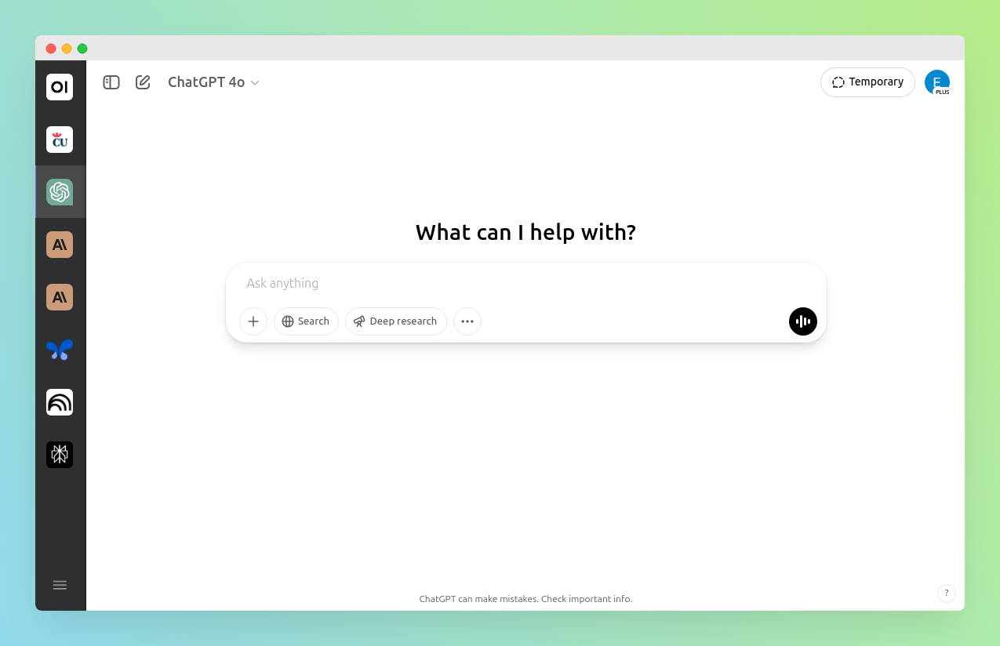

# Různí chatboti v jedné aplikaci

Už pár let používám open-source aplikaci [Ferdium](https://ferdium.org/). Díky ní můžu mít různé služby, např. Gmail, Google Kalendář nebo Discord v jednom rozhraní bez nutnosti používat běžný prohlížeč. Zároveň můžu být přihlášený k pracovnímu i soukromému účtu zároveň aniž bych se musel odhlašovat a přepínat. Jednu službu lze přidat vícekrát, pokaždé s jiným účtem, protože každá běží izolovaně. Díky Ferdiu se mi tak nemýchají dohromady věci jako čtení emailů, chatování a prohlížení internetu. Mohu se i lépe soustředit - notifikace zůstávají ve Ferdiu a dají se případně vypnout.

Stejný princip jde uplatnit i pro různé chatboty a další AI nástroje. Namísto lovení záložek v prohlížeči mohou být přehledně ve Ferdiu, viz níže. (Ferdium je postavené na technologii [Electron](https://www.electronjs.org/) - jedná se tedy v principu o webové stránky běžící v Chromiu. Služby tudíž nejsou plnohodnotné desktopové aplikace.)

/// caption
Screenshot aplikace Ferdium. Vytvořeno s pomocí [Screely](https://screely.com/) a [GIMP](https://www.gimp.org/).
///

Jak je vidět v levém panelu, ikona Anthropic (Claude) je tam 2x - jednou jako soukromý a jednou jako pracovní účet.

Zhruba před rokem jsem zkoušel přidat službu ChatGPT, ale nešlo se mi přihlásit. Nyní to vypadá, že problém byl odstraněn. Některé služby (ChatGPT, Claude, Perplexity) jsou dostupné v katalogu služeb, jiné (Google AI Studio, NotebookLM, Open WebUI) je potřeba přidat manuálně, resp. doplnit URL. Co se týče Open WebUI, měl jsem trochu obavu, jestli se Ferdium dokáže připojit i na lokálně běžící server, konkrétně `http://0.0.0.0:8080/`, a ano, zvládne to.

Užitečnou funkcionalitou jsou 'workspaces', díky které mám AI nástroje v samostatném pracovním prostoru (viz obrázek výše), ve kterém mě nerozptylují ikony Gmalu nebo Discordu.
