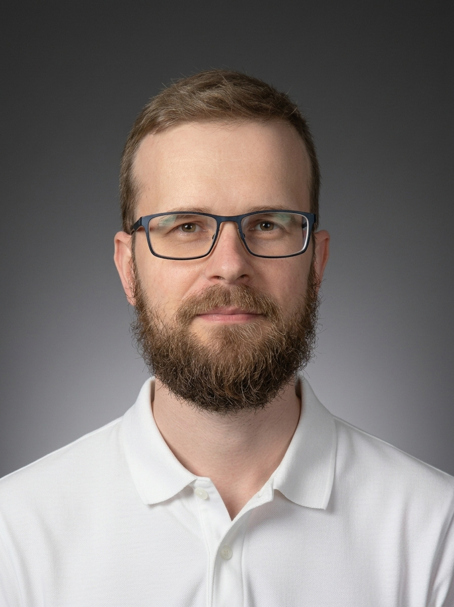

# Petr Beránek

[beranek@duck.com](mailto:beranek@duck.com) | +420 608 057 106 | [Blog](index.md) | [Projects](projects.md) | [GitHub](https://github.com/peberanek)

_Tinkering with open-source software, including Linux, Python and generative AI_

{ .cv-portrait width="300" }

## Experience

### Charles University

_AI Methodologist_ (3/2024 - 1/2026)

* Responsible for development and testing of [AI Sandbox](projects.md/#ai-sandbox)
* Collaborate with both internal stakeholders and external partners on AI-related topics
* Initiated the university-wide working group on Generative AI
* Founded and co-develop the AI Newsletter
* Attend conferences and workshops to stay up to date with developments in the field
* Facilitated a small team during a hackathon to develop AI tutors

### Red Hat

_Software Quality Engineer_ (10/2019 - 3/2022, 10/2022 - 7/2023)

* Developed [an internal testing framework](projects.md/#internal-testing-framework-for-lvm) for LVM and Red Hat High Availability Cluster
* Collaborated on test analysis, manual and automated testing of LVM
* Helped with manual and automated testing of Anaconda (the OS installer)
* Took a 6-month break in 2022 to recover from post-COVID burnout

### ING Bank

_Trainee - Tech Area_ (1/2019 - 9/2019)

* Contributed to systems analysis that enabled major technology upgrade
* Developed automation scripts using Python and Windows Cmd

### Ness Digital Engineering

_Junior Software Quality Engineer_ (3/2018 - 10/2018)

* Performed manual testing of TELCO applications
* Created test analysis and coordinated manual testing of a mobile game

### Other

_Various roles in administration and services_ (2012 - 2017)

## Professional Development

* Charles University, _various workshops and seminars on use, risks and impact of generative AI_ (2024 - present)
* Harvard University, _CS50's Introduction to Computer Science_ (online, 2024)
* Red Hat University, _Red Hat System Administration I_ (online, 2023)
* Red Hat University, _Red Hat OpenShift I: Containers & Kubernetes_ (online, 2020)
* AKCENT International House Prague, _English courses from B2 to C1_ (2019)
* GOPAS IT training center, _Git - Version Control System_ (2019)
* Stanford University, _Introduction to Computer Networking_ (online, 2019)
* Stanford University, _Introduction to Databases_ (online, 2018)
* MIT, _Introduction to Computer Science and Programming in Python_ (online, 2017)
* Charles University, _English courses from B1 to B2_ (2017)

## Personal Development

* Charles University, _Intensive Medical First Aid Course_ (2025)
* tinyhabits.com, _The Tiny Habits Method_ (online, 2022)
* Bemindful.cz, _Mindfulness-based stress reduction training_ (online, 2022)
* Khan Academy, _US History_ (online, 2017)
* Khan Academy, _Computers and the Internet_ (online, 2017)
* Khan Academy, _Math_ (online, 2016 - 2017)

## Education

* University of West Bohemia, _Bachelor's degree in Humanities Studies_ (2008 - 2011)
* Integrovaná střední škola Cheb, _high school diploma_ (2004 - 2008)

## Skills & Tools

* Languages: English (B2), Czech (native speaker)
* Generative AI: Open WebUI, LiteLLM, Ollama, API platforms (OpenAI, Anthropic, OpenRouter), ChatGPT, Claude
* Programming and automation: Python, shell, git & GitHub, Claude Code, Docker, SQL
* Linux system administration (Ubuntu, RHEL/Fedora)

## Interests & Activities

* Therapeutic fitness, kickbiking, walking, swimming
* Reading, blogging
* [Personal finance](projects.md/#personal-finance)
* Experimenting with mindfulness and the Tiny Habits method
* [Photography, digital art & design](https://www.behance.net/PetrBeranek)
