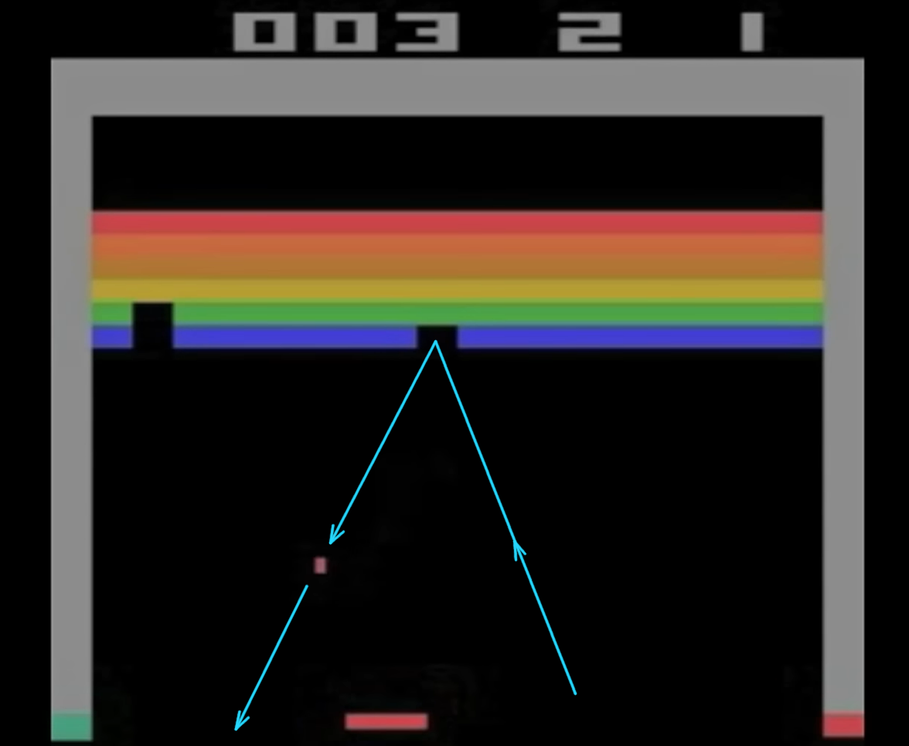
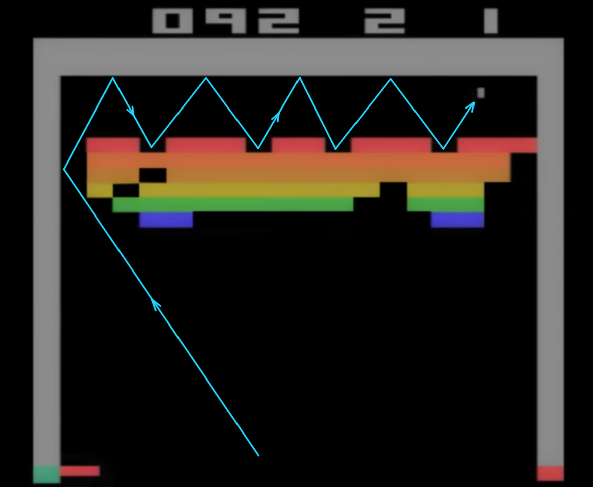

# AI jako nástroj hledání nových řešení

Andrej Karpathy ve svém videu [Deep Dive into LLMs like ChatGPT](https://www.youtube.com/watch?v=7xTGNNLPyMI) (konkrétně v části o Reinforcement Learning) zmiňuje film [Alphago (2017)](https://www.youtube.com/watch?v=WXuK6gekU1Y). Vřele doporučuji. Film pojednává o stejnojmenném programu, který jako první dokázal porazit Lee Sedola - jednoho z nejlepších hráčů hry Go, považované za výrazně komplexnější než třeba šachy. Ve filmu mě zaujala mimo jiné úvodní scéna zmiňující jinou hru - Breakout. Názorně ukazuje, jak program dokázal už po 500 hrách nalézt optimální strategii:

<!-- more -->

> Virtual environments and games, we think they're the perfect platform for developing and testing AI algorithms. Games are very convenient, in that a lot of them have scores, so it's very easy to measure incremental progress. [...]
>
> So let's start off with Breakout. So here you control the bat and ball, and you're trying to break through this rainbow-colored wall. The agent system has to learn everything for itself,
just from the raw pixels. It doesn't know what it's controlling. It doesn't even know what the object of the game is. Now, at the beginning, after 100 games, you can see the agent is not very good. It's missing the ball most of the time. But it's starting to get the hang of the idea that the bat should go towards the ball.

> Now, after 300 games, it's about as good as any human can play this, and pretty much gets the ball back every time. We thought, "Well, that's pretty cool." But we left the system playing for another 200 games, and it did this amazing thing. It found the optimal strategy was to dig a tunnel around the side, and put the ball round the back of the wall.

> **The researchers** working on this, the amazing AI developers, well, they're not so good at Breakout, and they **didn't know about that strategy. So, they learned something from their own system, which is, uh, you know, pretty funny and quite instructive**, I think, about the potential for general AI.
