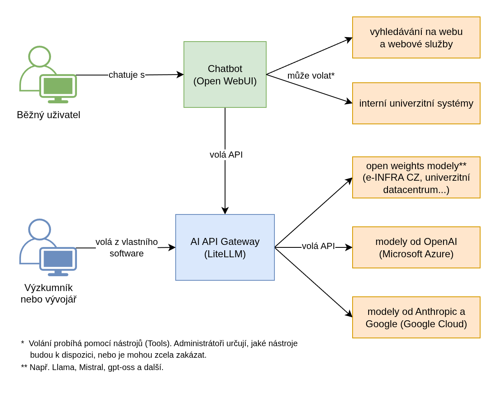

# AI Sandbox: zkušenosti z pilotního provozu na Univerzitě Karlově

_Už dříve jsem psal [o motivaci pro vytvoření open source AI Sandboxu](../posts/open-source-ai-sandbox.md). Cílem tohoto článku je záměr zpřesnit a doplnit o dosavadní zkušenosti z implementace v univerzitním prostředí._

S popularitou aplikace ChatGPT vzrostl zájem členů akademické obce Univerzity Karlovy o využívání generativní umělé inteligence ve výuce a výzkumu, při studiu a v práci. Spolu s tím se však objevily následující problémy:

* Řada uživatelů vyjádřila **oprávněné obavy z úniku citlivých osobních, provozních či výzkumných dat**, zejména v souvislosti s používáním veřejně dostupných verzí populárních chatbotů. Jejich poskytovatelé totiž často využívají vkládaná data k dalšímu tréninku a nepříliš jasnému "zlepšování svých produktů". Nedávno také Národní úřad pro kybernetickou bezpečnost vydal [varování před některými produkty společnosti DeepSeek](https://nukib.gov.cz/cs/infoservis/aktuality/2279-nukib-vydal-varovani-pred-nekterymi-produkty-spolecnosti-deepseek/), jejichž využívání bylo na UK obratem zakázáno.
* V praxi se ukazuje, že **reálné využívání nakoupených předplatných bývá nízké**. Jen část uživatelů je skutečně aktivní, a někteří si svůj účet ani neaktivují. Pokročilí uživatelé pak dříve či později narazí na limity. Navíc v případě, kdy je předplatných pořízen jen omezený počet, lze očekávat vlnu nevole, že někdo přístup dostal a jiný ne.
* **Uzavření akceptovatelných smluv na Enterprise (příp. Edu) verze chatbotů není snadné**. Někteří významní poskytovatelé s českými univerzitami buď nekomunikují, nebo vyžadují vysoké počty nakoupených předplatných za nepříliš lákavou cenu.

Logickým krokem, kterým se řada organizací vydává, je prozkoumat existující open-source řešení hostovaná na vlastním hardware. Navíc, poskytovatelé jako OpenAI, Anthropic nebo Google umožňují volat své služby prostřednictvím API v režimu _pay-as-you-go_. Tím pádem se platí jen za reálnou spotřebu, nikoliv paušálně za jednotlivé uživatele, a otevírá se tak cesta k možnému snížení nákladů.

<!-- more -->

## Inspirace v zahraničí i v tuzemsku

Výše uvedené problémy [řešili také na Harvard University](https://www.youtube.com/watch?v=61zn8Q6lK08). Na základě informací z univerzitních komisí zjistili, že mají velkou poptávku po využívání AI nástrojů při výuce, a proto se rozhodli vytvořit vlastní řešení. Výsledkem je [služba **Harvard AI Sandbox**](https://www.huit.harvard.edu/ai-sandbox):

> The AI Sandbox provides a secure environment in which to explore Generative AI, mitigating many security and privacy risks and ensuring the data entered will not be used to train any vendor large language models (LLMs). It offers a single interface that enables access to the latest LLMs from OpenAI, Anthropic, Google, and Meta.

Z pohledu běžného uživatele se jedná o webové chatovací rozhraní podobné ChatGPT, postavené na open source aplikaci [LibreChat](https://www.librechat.ai/). Pracovat lze s modely od různých poskytovatelů (viz výše), přičemž uživatelé mají povoleno vkládat jen [data do úrovně rizika 3](https://www.huit.harvard.edu/ai/tools) (_"Moderate impact on university operations, research, reputation, or finances"_). Více viz [University Risk Classifications](https://privsec.harvard.edu/classify-risk).

Podobný přístup zaujali i na Stanford University. Pro svou akademickou obec vytvořili platformu [**AI Playground**](https://uit.stanford.edu/service/aiplayground), která vedle [chatovacího rozhraní](https://uit.stanford.edu/aiplayground) (také LibreChat) nabízí i centrálně spravovaný přístup k modelům přes API. Nazvali jej [**AI API Gateway**](https://uit.stanford.edu/service/ai-api-gateway) a stojí na open source aplikaci [LiteLLM](https://www.litellm.ai/). Podporu tak mají nejen běžní uživatelé, ale také výzkumníci a vývojáři, kteří potřebují volat modely programaticky nebo ve vysokých objemech vkládaných a generovaných dat.

Inspirací z tuzemska nám jsou aktivity národní výpočetní infrastruktury [e-INFRA CZ](https://www.e-infra.cz/), konkrétně centra [CERIT SC](https://www.cerit-sc.cz/). Jednou z nich je zpřístupnění [různých AI nástrojů](https://blog.e-infra.cz/blog/chat-ai/), mezi nimi i [chatovacího rozhraní **Chat AI**](https://docs.cerit.io/en/docs/web-apps/chat-ai), postaveného na open source aplikaci [Open WebUI](https://docs.openwebui.com/). Uživatelé mohou chatovat s různými open weights modely běžícími na infrastruktuře e-INFRA CZ, případně i s některými modely placenými. Tato aplikace zároveň umožňuje volat modely i přes API. Pro přístup stačí mít platný účet [v MetaCentru CESNETu](https://metavo.metacentrum.cz/cs/) (více viz [přihláška](https://metavo.metacentrum.cz/cs/application/index.html)).


/// caption
Chatovací rozhraní aplikace Open WebUI
///

Zde bych rád zmínil, že i chatovací rozhraní AI Sandboxu je hostováno na infrastruktuře e-INFRA CZ, a to jako samostatný klon Open WebUI. Díky tomu můžeme využívat jejich výkonné open weights modely. Zároveň platí, že do naší instance mají přístup jen uživatelé Univerzity Karlovy, a to prostřednictvím Centrální autentizační služby UK (CAS). Za nasazení a pomoc se správou kolegům z e-INFRA CZ, resp. CERIT SC, velmi děkujeme. Pro zájemce o bližší informace o tom, co obnáší hostování velkých jazykových modelů na vlastní infrastruktuře vřele doporučuji jejich článek [Silicon Vampires: How Do We Run LLMs](https://blog.e-infra.cz/blog/run-llm/).

## Očekávání a skutečnost

Samozřejmě platí, že open source neznamená dokonalé řešení. Některé projekty jsou vysloveně špatné, řada zůstává nedotažena, a jen některé jsou skutečně kvalitní a s dobrou - zejména dlouhodobou - podporou. Proto jsme zhruba před rokem po delším výběru a zkoušení nasadili malou testovací instanci s Open WebUI + [Ollama](https://ollama.com/). Výhodou je, že se obojí dá relativně jednoduše nainstalovat na osobním počítači, vyzkoušet a až poté nasadit jako webovou aplikaci na serveru. (LibreChat jsem na počátku také zkoušel, ale vzhledem k tomu, že v něm tehdy byla správa uživatelů dosti složitá, zvítězilo populárnější Open WebUI.)


Výběr projektů - proč Open WebUI, LiteLLM, Ollama, vLLM

Překvapilo mě

* malá podpora vedení - slovní ano, ale personální a finanční jen minimální, snad pomůže tým RSE
* malá snaha se aktivně zapojit - všichni čekají, až to někdo jiný zařídí

Propast mezi pilotem a ostrým provozem je velká.

## TODO

Díky překvapivým obtížím s pořízením Edu verze ChatGPT (a dalších pokročilých chatbotů) jsme se před rokem a půl rozhodli prozkoumat open source řešení. Na základě podobných projektů zahraničních univerzit jsme nasadili chatovací platformu nazvanou AI Sandbox. Jaká byla naše očekávání a jaká je realita? V čem se platforma osvědčila a co nás brzdí? Jak složité (nebo jednoduché) by bylo nasadit ji i u vás? Přijďte se dozvědět víc a sdílet zkušenosti.

Kategorizace dat: https://openscience.cuni.cz/OSCI-95.html

* Design - tech popis
* Zkušenosti a zůžení scope
* Co nás brzdí, road map


# Open source AI Sandbox: Detaily a zkušenosti

_Už dříve jsem psal [o motivaci pro vytvoření open source AI Sandboxu](../posts/open-source-ai-sandbox.md). Cílem tohoto článku je záměr zpřesnit a doplnit o dosavadní zkušenosti z implementace v univerzitním prostředí._

## 1. Stručný popis

Open source AI Sandbox (dále jen _AI Sandbox_) je koncipován jako **webová služba pro jednoduchý bezpečný přístup k modelům GenAI** (generativní umělé inteligence). Služba se skládá z: 

1. **Chatbota** pro běžné uživatele podobného ChatGPT, 
2. **AI API Gateway** pro výzkumníky a vývojáře, umožňující volat a používat modely GenAI z jejich vlastního software. 

AI Sandbox je sestaven z populárních open source projektů. Díky tomu je auditovatelný, přizpůsobitelný a dostupný všem zájemcům o nasazení a spolupráci. Je inspirován podobnými službami v Česku i v zahraničí – např. [Chat AI](https://docs.cerit.io/en/docs/web-apps/chat-ai) (CERIT-SC / Masarykova Univerzita), [AI Sandbox](https://www.huit.harvard.edu/ai-sandbox) (Harvard University) nebo [AI Playground](https://uit.stanford.edu/service/aiplayground) (Stanford University). 


/// caption
Grafické uživatelské rozhraní Chatbota (aplikace Open WebUI)
///

Příklad volání modelu přes AI API Gateway:

``` py
import openai
client = openai.OpenAI(
    api_key="API-KEY", # set API key
    base_url="http://GATEWAY-URL:4000"  # set Gateway URL
)

response = client.chat.completions.create(
    model="gpt-4.1-2025-04-14", # set an available model
    messages = [
        {
            "role": "user",
            "content": "this is a test request, write a short poem"
        }
    ]
)

print(response)
```

<!-- more -->

## 2. Důvody vzniku

### 2.1 Bezpečnost 

S rostoucí popularitou aplikace ChatGPT došlo ke zvýšenému zájmu veřejnosti i organizací o nástroje využívající modely GenAI. Uživatelé jsou vynalézaví, a v případě, že jim univerzita neposkytne přístup k bezpečné a zároveň dostatečně dobré verzi těchto nástrojů, začnou používat jejich snadno dostupné varianty pro pracovní a studijní účely. Jedním z rizik bezplatných, příp. i některých placených variant je, že veškerá vkládaná data (text, dokumenty, obrázky apod.) jsou ukládána na cizích serverech a používána k dalšímu trénování modelů. 

**Hrozí tedy, že univerzita ztratí kontrolu nad citlivými daty** (osobní a přihlašovací údaje, výzkumná data, smlouvy, nepublikované články, finanční zprávy, lékařské snímky apod.) a vystavuje se tak bezpečnostním, právním a reputačním rizikům. Nedávno například Národní úřad pro kybernetickou bezpečnost vydal [Varování před některými produkty společnosti DeepSeek](https://nukib.gov.cz/cs/infoservis/aktuality/2279-nukib-vydal-varovani-pred-nekterymi-produkty-spolecnosti-deepseek/) s hodnocením hrozby '_na úrovni "Vysoká", tedy jako pravděpodobná až velmi pravděpodobná._'

Cílem AI Sandboxu je poskytnout snadno dostupné, kontrolované a bezpečné prostředí, ve kterém nebudou vkládaná data používána k trénování modelů GenAI (ani jakkoliv jinak), a ukládána budou buď na serverech univerzity nebo některé důvěryhodné partnerské organizace. 

### 2.2 Finanční efektivita 

Investice do pořízení bezpečných a zároveň výkonných nástrojů může být finančně nákladná. Z dosavadních zkušeností vyplývá, že **většina uživatelů využije jen zlomek z ceny běžného předplatného**, a naopak někteří pokročilí uživatelé dříve či později narazí na limity v počtu dotazů za den nebo měsíc. Navíc méně než 1/3 uživatelů nástroje skutečně využívá.

AI Sandbox umožňuje využívat jak modely GenAI běžící na vlastním hardware, tak volat placené modely 3. stran přes API, kde se zpravidla platí jen za vygenerované tokeny. Pro představu, u nejnovějšího modelu GPT-5 lze **za 1 dolar vygenerovat přibližně 100 tísíc tokenů, což je cca 50 tisíc slov v češtině neboli 1 kratší román.** Neaktivní uživatelé tokeny negenerují, tedy se za ně neplatí. Tím se nabízí možnost redukovat náklady na běžné uživatele a poskytnout vyšší limity uživatelům pokročilým. 

Pro výzkumníky a vývojáře je cílem nabídnout přístup k modelům GenAI přes jednotné API rozhraní. Uživatel nemusí řešit bezpečnost, nabíjení kreditu nebo administraci. V ideálním případě se jen domluví na požadovaných modelech, limitech a formě úhrady výdajů. Následně obdrží API klíč a může začít modely používat. 

### 2.3 Flexibilita 

Oblast GenAI se vyvíjí velmi dynamicky. Modely a služby, které byly ještě před rokem považovány za špičku, bývají dnes překonané nebo nabízené zdarma. Cílem AI Sandboxu je být maximálně flexibilní jak po stránce použitých komponent, tak po stránce napojení na široký výběr poskytovatelů včetně vlastního hardware. Tím se **zmírňuje i riziko vendor lock-in neboli závislosti na službách a produktech konkrétního dodavatele**.

Díky tomu, že AI Sandbox je open-source software, použité komponenty lze auditovat a upravovat. Nutno podotknout, že AI Sandbox ve funkci Chatbota není v tuto chvíli kompletní náhradou za nejpokročilejší komerční aplikace jako ChatGPT, Claude nebo Gemini. Jejich výrobci budou pravděpodobně vždy o krok napřed. Na druhou stranu, řadu případů použití dokáže pokrýt a zároveň **může být rozšířen a upraven na míru cílovým skupinám a univerzitnímu prostředí**.

## Využití 

Následující text popisuje některé příklady využití, požadavky a problémy, se kterými jsem se za poslední rok a půl v univerzitním prostředí setkal. 

### Běžné použití 

V rámci pilotního testování se ukazuje, že AI Sandbox, resp. Chatbot spolehlivě provádí úkoly jako analýzu textu a obrázků, stylistické úpravy a překlady textů, brainstorming nebo generování jednoduchého programového kódu. Samozřejmě vždy záleží na kvalitě dostupných modelů a nástrojů se kterými mohou modely pracovat.

Uživatelé také mohou vytvářet asistenty podobné GPTs v ChatGPT. Navíc mají možnost ladit pokročilé parametry chatu jako System Prompt, Temperature nebo Reasoning Effort, které v jiných chatbotech nebývají k dispozici a tím dosáhnout většího přizpůsobení výstupů. 

### Výuka 

Typickým problémem je absence jednotného prostředí pro výuku s využitím GenAI. Univerzity sice mohou mít k dispozici jednoduché chatboty jako Microsoft Copilot s bezpečnostními garancemi enterprise licence. V praxi se však ukazuje, že uživatelé jsou často nespokojeni s kvalitou výstupů nebo s omezenou funkcionalitou. **Členové akademické obce jsou tak nuceni používat bezplatné verze nástrojů jako ChatGPT, příp. si je platit sami.** Řada z nich je tím znevýhodněna, a ani u placených verzí pro osobní použití nemají jistotu, že vkládaná data nejsou dále vytěžována. 

Cílem AI Sandboxu je toto jednotné prostředí poskytnout, přičemž toto prostředí může být dále upraveno podle potřeb cílových skupin. [Například se ukazuje](https://www.youtube.com/watch?v=KNUFNTj-yMQ), že **vytvoření pedadogicky užitečného AI tutora s ověřitelnými výsledky je netriviální problém mimo rámec běžných chatbotů jako ChatGPT**. Případné úpravy s sebou samozřejmě nesou náklady na vývoj a údržbu. Protože se však jedná o otevřený software, tuto činnost mohou provádět stávající vývojáři.

### Výzkum 

Podobně jako v případě výuky, problémem bývá **absence bezpečného flexibilního přístupu pro potřeby výzkumu**. Opakovaně se setkávám s návrhy na pořízení výkonných laptopů nebo serverů pro běh jazykových modelů lokálně. Výzkumníci tak činí v naději, že budou mít alespoň něco, a zároveň tyto modely poběží bezpečně na hardwaru pod jejich kontrolou. V praxi se však ukazuje, že tento hardware stačí jen na provoz méně výkonných modelů, které navíc bývají pomalé a pro češtinu zatím nepoužitelné. 

Teoreticky mohou výzkumníci získat přístup k výkonným modelům přes API poskytovatelů jako OpenAI, Anthropic nebo Google. V praxi jim ale striktní podmínky financování neumožňují tyto služby platit (např. není dovoleno nakoupit předplacený kredit), nebo nemají dostatečné bezpečnostní záruky pro vkládaná data, které zpravidla garantuje jen institucionální smlouva (např. pro služby Microsoft Azure nebo Google Cloud). 

Služba AI Sandbox, zejména AI API Gateway, nabízí výzkumníkům cestu jak generovat výstupy bezpečněji, rychleji, s minimální administrativní zátěží a za zlomek ceny nového hardware. 

### Vývoj 

Jako perspektivní oblast pro GenAI se jeví asistence programátora/administrátora a generování programového kódu. Třebaže [využití v reálných podmínkách je stále omezené](https://news.mit.edu/2025/can-ai-really-code-study-maps-roadblocks-to-autonomous-software-engineering-0716), **už dnes mohou i neprogramátoři vytvářet užitečné testovací prototypy a jednoúčelové programy** - např. interaktivní hru pro přednášku nebo cvičení.

Univerzitám je sice zdarma dostupný např. GitHub Copilot, [bezplatně ho mohou ale využívat jen studenti a akademici](https://github.com/education). AI API Gateway nabízí přístup k pokročilým programovacím agentům jako [OpenAI Codex CLI](https://docs.litellm.ai/docs/tutorials/openai_codex), [Claude Code](https://docs.litellm.ai/docs/tutorials/claude_responses_api) nebo [Gemini CLI](https://docs.litellm.ai/docs/tutorials/litellm_gemini_cli) všem uživatelům a s případnými garancemi institucionální smlouvy. Opět se platí pouze za vygenerované tokeny, čili je možné **průběžně testovat skutečnou efektivitu těchto nástrojů bez nutnosti závazků k měsíčnímu předplatnému.**

## Technický popis

AI Sandbox je sestaven z populárních open source projektů. Zároveň je k němu možné připojit další služby. Na obrázku níže je schéma znázorňující cílové skupiny, jednotlivé komponenty a některé vybrané služby.


/// caption
Schéma AI Sandboxu
///

### Chatbot 

Jako uživatelské rozhraní chatbota slouží aplikace [Open WebUI](https://docs.openwebui.com/), kterou úspěšně nasadili a provozují např. v rámci [Chat AI](https://docs.cerit.io/en/docs/web-apps/chat-ai) (CERIT-SC / Masarykova Univerzita) nebo je součástí enterprise platformy [Suse AI](https://www.suse.com/products/ai/) (SUSE S.A.). Aplikace je podobná ChatGPT. Mimo chatování s různými modely nabízí také možnost vkládat soubory a budovat znalostní báze, generovat obrázky, vytvářet asistenty podobné GPTs v ChatGPT nebo analyzovat data.

!!! Poznámka

    Alternativně, služby AI Sandbox (Harvard University) a AI Playground (Stanford University) používají aplikaci [LibreChat](https://www.librechat.ai/docs), která je v principu velmi podobná. V době, kdy jsem ji pro naše účely testoval, však postrádala administrátorské rozhraní a proto se stalo Open WebUI preferovanou variantou.

Správu provádí uživatelé s rolí administrátora. Běžní uživatelé mohou být rozděleni do skupin s detailní kontrolou uživatelských oprávnění. K přihlašování lze využít [různé metody SSO](https://docs.openwebui.com/features/sso/).

Vedle vestavěných nástrojů (Tools) jako Web Search a Code Interpreter je aplikace rozšířitelná o nástroje vlastní nebo [vytvořené komunitou](https://openwebui.com/tools). V principu se jedná moduly programovacího jazyka Python, což přináší velkou flexibilitu při implementaci. Na druhou stranu je potřeba kód důsledně zkontrolovat a zabezpečit nejen před standardními kybernetickými hrozbami, ale také před [nebezpečnou trojkombinací umožňující zneužít Prompt Injection](https://simonwillison.net/2025/Jun/16/the-lethal-trifecta/). Administrátor určuje, jaké nástroje mohou uživatelé používat, nebo je úplně zakázat. Totéž platí pro přidávání funkcionality pomocí [Functions & Pipelines](https://docs.openwebui.com/features/plugin/). 

Aplikace sama o sobě neumí počítat a limitovat útratu u placených modelů. Proto Ústřední knihovna Univerzity Karlovy spolupráci s Katedrou informatiky a výpočetní techniky Západočeské univerzity v Plni vyvíjí doplněk (také open source), který tuto funkcionalitu zajistí. V omezené míře by tuto funkcionalitu měla umět poskytnout i [AI API Gateway, resp. LiteLLM](https://docs.litellm.ai/docs/tutorials/openweb_ui).

Chatbot je v současné době nasazen na Univerzitě Karlově v pilotním provozu s vybranou skupinou uživatelů.

### AI API Gateway

Jako jednotné API rozhraní slouží aplikace [LiteLLM](https://docs.litellm.ai/), která je stejným způsobem použita např. v [AI Playground](https://uit.stanford.edu/news/developers-can-now-try-out-ai-api-gateway) (Stanford University). Cílovou skupinou uživatelů jsou technicky zdatní výzkumníci nebo vývojáři, kteří chtějí nebo potřebují volat modely z vlastních programů pomocí API klíčů. Připojit se je možné na široké množství poskytovatelů včetně open weights modelů běžících např. na lokálních GPU serverech nebo v univerzitních datacentrech.

Všechny modely jsou volány pomocí OpenAI-kompatibilního API rozhraní, díky čemuž není nutné řešit implementační rozdíly jednotlivých poskytovatelů. Aplikace umožňuje přidělovat API klíče jednotlivcům i týmům, umožňuje určit, jaké modely budou pro daný API klíč k dispozici a s jakými limity. Součástí je také analytika o využívání a útratě. 

Správu a přidělování API klíčů provádí uživatelé s rolí administrátora. Přihlašování probíhá pomocí jména a hesla. Přihlášení přes SSO je součástí enterprise předplatného, které pro základní provoz není potřeba, nicméně s velkým množstvím uživatelů a komplexními případy použití může být žádoucí.

### Další služby

Pro hosting široce dostupných **open weights modelů** (např. Llama, Gemma, Mistral) se nabízí využít existující GPU servery nebo datacentra. Univerzita tak má jistotu, že vkládaná data neopouští hardware pod její kontrolou. V praxi se často používá inferenční server [vLLM](https://docs.vllm.ai/en/stable/), na kterém staví např. technologická společnost Red Hat (IBM). Modely běžící na těchto serverech je poté možné připojit k LiteLLM i přímo k Open WebUI přes OpenAI-kompatibilní rozhraní.

Nutno podotknout, že pro běh těch nejvýkonnějších open weights modelů je potřeba také velmi výkonná infrastruktura, kterou disponuje např. [konsorcium e-INFRA CZ](https://www.e-infra.cz/) (jeho součástí je i CESNET). Další možností je běh menších modelů dotrénovaných a optimalizovaných pro specifické oblasti. Praktickou použitelnost takových modelů však bude třeba ověřit v praxi.

Pro využívání **proprietárních ("closed source") modelů** se nabízí využít některého z velkých cloudových poskytovatelů a jejich služeb jako Microsoft Azure nebo Google Cloud. Třebaže pak data opouští prostředí AI Sandboxu, tito poskytovatelé zpravidla nabízí vysoké garance stran bezpečnosti a soukromí. Pro data s přiměřenou rizikovostí to může být velmi vhodná varianta, zejména z pohledu rychlosti zpracování, ceny a případných slev.

## Odhadovaná nákladovost

### Běžný provoz

Na základě zkušeností z provozu obdobné služby na Harvard University a z pilotního testování jsou odhadované náklady placených modelů na 100 uživatelů okolo 8 tisíc Kč měsíčně. (Zpravidla 1/3 uživatelů službu reálně využívá, tedy 33. Z nich 2/3 (tedy 22) utratí méně než 1 dolar měsíčně. Předpokládejme, že zbytek (11) je velmi aktivní a utratí 30 dolarů měsíčně. Tedy (22\*1 + 11*30) * kurz dolaru vůči Koruně (23) = 8096 Kč.) 

Protože se jedná pouze o odhad, je potřeba u placených modelů nastavit přiměřené limity a definovat tak maximální útratu. U modelů běžícím na vlastním hardware je potřeba počítat s odpovídajícími provozními náklady, protože pro rychlou odezvu musí mít modely neustále dostupnou výpočetní paměť. Výdaje za používání AI API Gateway se mohou výrazně lišit případ od případu, a proto je težké je předem odhadovat. Opět je možné si stanovit limity.

Vedle toho je třeba zajistit administrátory, kteří službu nasadí, budou ji aktualizovat a udržovat, poskytnou uživatelskou podporu a budou nasazovat a testovat nové funkce.

### Enterprise předplatné a servisní podpora 

V případě aplikace Open WebUI je možné se dohodnout s hlavním vývojářem na enterprise předplatném se servisní podporou (např. pomoc s řešením technických problémů a opravy zjištěných chyb). Podle poslední nabídky se však platí předplatné podle počtu uživatelů a citelně se tak zvednou náklady na provoz. Alternativou je zajistit vlastního vývojáře, který by dokázal podobnou podporu poskytovat.

Aplikace LiteLLM nabízí některé funkce (např. Single Sign-On, správa uživatelů podle organizací a projektů nebo pokročilé bezpečnostní funkce) formou enterprise předplatného, které se může pohybovat v řádech stovek až tisíců dolarů měsíčně. V počáteční fázi provozu by nemělo být potřeba, nicméně může začít dávat smysl ve chvíli, když se služba začne hojně využívat. 

## Analýza rizik

### Kybernetická bezpečnost

Vedle rizik typických pro veřejně dostupné webové služby je třeba počítat s riziky spojenými s používáním velkých jazykových modelů:

* **Únik dat prostřednictvím Prompt Injection**: Velké jazykové modely jsou trénované následovat instrukce, díky čemuž jsou tak užitečné. Nicméně se ukazuje, že model vykoná jak instrukce zadané uživatelem, tak _i záškodné instrukce ukryté ve vstupních datech_ (např. na webové stránce nebo v textu, který má shrnout). Navzdory tomu, že se jedná o známou, a [aktivně zneužívanou zranitelnost](https://simonwillison.net/tags/exfiltration-attacks/), žádný z výrobců modelů nebyl dodnes schopen ji uspokojivě vyřešit. Administrátoři proto musejí být obeznámeni s tímto typem útoku, a vždy důkladně zvážit, zda daný nástroj dostupný modelům (nebo kombinace nástrojů) neumožňuje aktivní zneužití. Za zvážení také stojí, zda vůbec využívat [populární MCP protokol](https://simonwillison.net/2025/Apr/9/mcp-prompt-injection/), dokud nebudou jeho bezpečnostní nedostatky vyřešeny.
* Únik dat prostřednictvím služby 3. strany:
* generování škodlivého obsahu: uživatelský vstup spustí vygenerování škodlivého obsahu, záměrně (Jail Break, LLM grooming) nebo nezáměrně - lze mitigovat nasazením tzv. Guardrails, neboli automatické analýzy a filtrování vstupů a výstupů; využíváním pouze kvalitních ověřeným modelů

### Soulad s platnou legislativou

* AI Act
    * používání modelů vysoce rizikovým způsobem - hodnocení výsledků studia, nábor zaměstnanců, lékařské rady
* GDPR a ochrana osobních údajů - opět guardrails, NDA pro adminy
* Ochrana autorských práv - ochrana vstupů: na vstupech se netrénuje, ochrana výstupů: ochranu nedokáží garantovat ani velké tech spol jako MS, slibuje pomoc při soudních sporech

### Provozní rizika

* škálování - musíme ověřit v praxi
* pouze 1 hlavní vývojář Open WebUI - vždy jde vytvořit fork a pak udržovat samostatně, příp. přejít na alternativní software (LibreChat)
