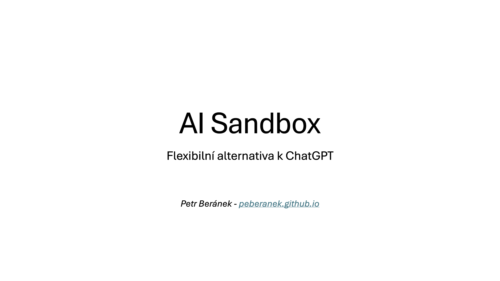
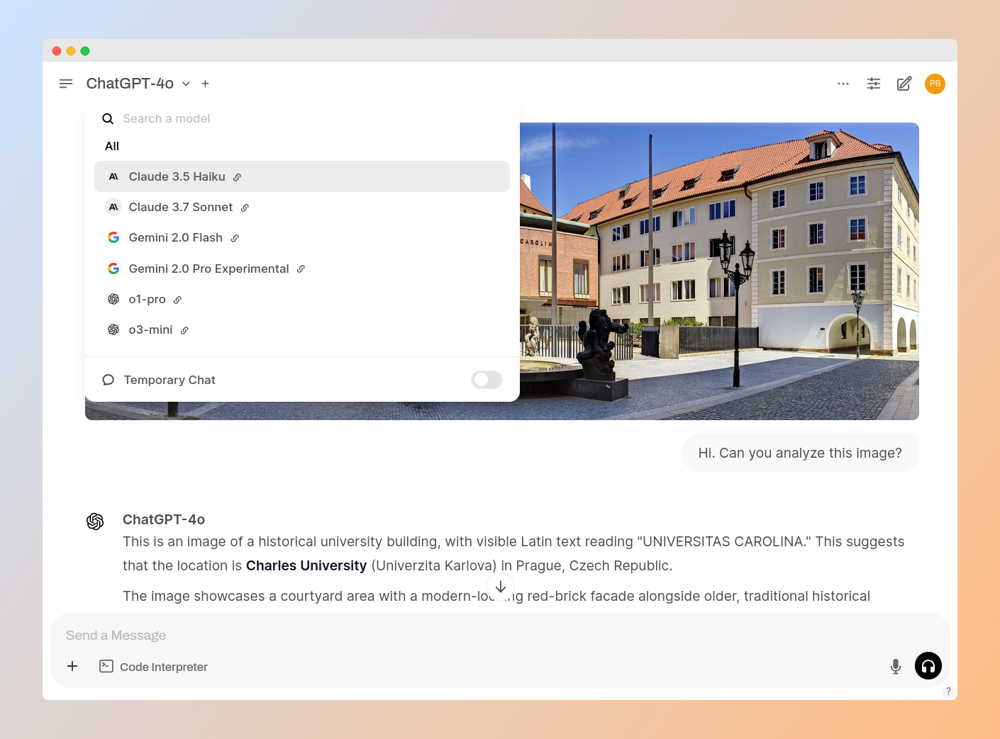
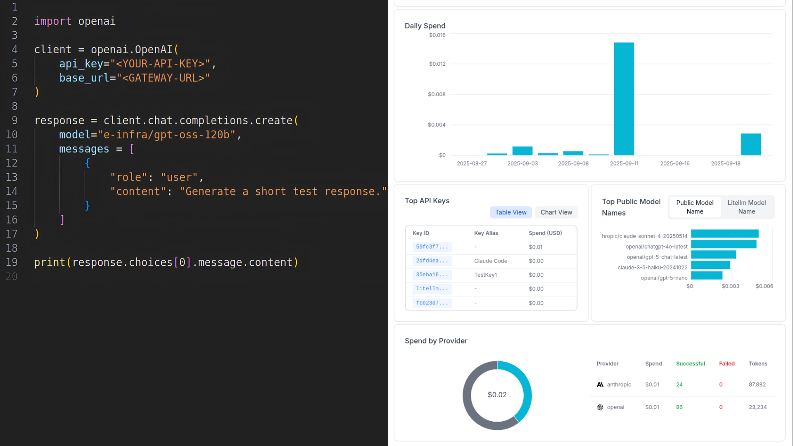

# AI Sandbox: zkušenosti z pilotního provozu na Univerzitě Karlově

_V lednu 2026 jsem se rozhodl změnit prostředí a odejít z pozice Metodika AI na Univerzitě Karlově. Článek níže je mým osobním ohlénutím se za zajímavým projektem AI Sandboxu, na kterém jsem poslední rok a půl pracoval, a zároveň slouží jako rozšíření prezentace pro Právnickou fakultu UK. Pro úplnost uvádím, že o tématu AI Sandboxu jsem [psal již dříve](../posts/open-source-ai-sandbox.md), nicméně tento text původní informace aktualizuje a zasazuje je do širšího kontextu._

V rámci kurzů generativní AI pro zaměstnance Univerzity Karlovy jsme brzy zjistili, že bezplatné verze chatbotů jako ChatGPT nebo Microsoft Copilot nabízí jen velmi omezenou funkcionalitu a potřebám (či zvědavosti) uživatelů často nestačí. Uživatelé mají typicky k dispozici jen levnější méně výkonný model bez možnosti výběru, nemohou vytvářet nebo sdílet specializované AI asistenty/agenty a počet chatů je limitován. V případě ChatGPT mohou být veškerá vkládaná data využívána výrobcem k "zlepšování jeho produktů", což vzbuzuje obavy při práci s citlivými informacemi.

Logickým krokem bylo tedy zjistit, jak tyto problémy řeší jiné univerzity.

## Co je to AI Sandbox

### Chatbot

AI Sandbox je platforma postavená na existujících open source technologiích, jejíž cílem je uživatelům poskytnout flexibilní bezpečný přístup ke generativní umělé inteligenci. Z pohledu běžného uživatele si lze představit _chatbota podobného ChatGPT_. Na obrázku níže je vidět chatovací rozhraní Sandboxu (aplikace [Open WebUI](https://docs.openwebui.com/)):

Hlavní rozdíl oproti ChatGPT je ten, že _chatbot běží na univerzitních serverech a administrátoři tak mají plnou kontrolu_ nad tím, k jakým modelům a funkcím mají (či nemají) uživatelé přístup, a jak se s vkládanými daty zachází. Tento koncept jsem poprvé zaznamenal na Harvard University v rámci jejich nástroje [Harvard AI Sandbox](https://www.huit.harvard.edu/ai-sandbox) (od něj vznikl i  název):

> The AI Sandbox provides a secure environment in which to explore Generative AI, mitigating many security and privacy risks and ensuring the data entered will not be used to train any vendor large language models (LLMs). It offers a single interface that enables access to the latest LLMs from OpenAI, Anthropic, Google, and Meta. Features include image generation, data visualization, and the ability to upload multiple files.

Podobný nástroj poskytuje svým uživatelům také Stanford University jako [Stanford AI Playground](https://uit.stanford.edu/aiplayground) a řada dalších institucí. V České republice je velmi aktivní organizace e-INFRA CZ (resp. CERIT SC - Masarykova Univerzita), které věnuji jednu z následujících kapitol.

Pointou těchto nástrojů je, že uživatelé pracují v prostředí pod správou a kontrolou dané organizace, a k dispozici mohou mít modely od různých výrobců, nejen ChatGPT (resp. GPT), ale také Claude nebo Gemini, včetně open weights modelů jako Mistral nebo DeepSeek běžících plně na vlastních serverech. A to vše v jedné aplikaci.

### API rozhraní

Pokročilí uživatelé (typicky výzkumníci nebo vývojáři) vyjádřili zájem volat modely z vlasních programů přes [API (application programming interface)](https://cs.wikipedia.org/wiki/API). Výzkumník má například tisíce souborů a chce analyzovat jejich obsah. Nemůže je nahrát všechny najednou, ale musí je předkládat jednotlivě. Místo toho, aby vše dělal ručně, vytvoří si programový skript, který interaguje s modelem napřímo, a výsledky navíc uloží do tabulky pro další zpracování.

Pomocí aplikace [LiteLLM](https://docs.litellm.ai/) lze uživatelům toto API zpřístupnit, přidělit jim požadované modely, nastavit limity a provádět monitoring. Na obrázku níže vlevo je jednoduché volání v jazyce Python (API rozhraní je OpenAI-kompatibilní). Vpravo je ukázka administrátorského rozhraní s přehledem útraty pro různé modely:

## Proč jednoduše nepořídit ChatGPT?

Zde se nabízí logická a častá otázka, proč zaměstnancům UK nepořídit ChatGPT a API rozhraní přímo od OpenAI.

nebo od nějakého jiného poskytovatele. Univerzita již má Microsoft Copilot, ale jen v omezené verzi.

Na ChatGPT jsme se ptali, ale OpenAI bohužel moc nekomunikovala. Konkrétní nabídku jsme z nich nedostali. Nabídka Anthropic byla velmi nevýhodná. Google do nedávné doby nereagoval.

Předplatné mohou být velmi nevýhodné: zkušenosti Harvard, UPOL, naše - pouze část uživatelé chatboty skutečně aktivně využívá (od 1/3 do 10%)

Data odchází ke zpracování na cizí servery a organizaci nezbývá, než zpracovateli důvěřovat.

Technologická závislost

## AI jako služba na e-INFRA CZ

---

1. Organizace semináře:
    1. Představit sebe
    1. Představit Davida Šlosara
    1. Náčrt co posluchače čeká: nejprve cca 20 minut přednáška, potom prostor na dotazy a diskusi
1. Co je AI Sandbox:
    1. "Flexibilní alternativa k ChatGPT hostovaná na vlastním hardware"
    1. Chatovací rozhraní, API platforma
1. Proč nepořídit ChatGPT?
    1. Vysoká cena a možná finanční neefektivita
    1. Data odchází na cizí servery (bude americká firma spolehlivý partner i za příštích x let?)
    1. Technologická závislost (jeden dodavatel, nemáme kontrolu nad funkcionalitou, nelze upravit na míru univerzitnímu prostředí)
1. Jak na to šli jinde:
    1. Harvard AI Sandbox (od nich název), Stanford AI Playground, e-INFRA CZ AIaaS
1. Jak na to šli jinde:
    1. e-INFRA CZ AIaaS
        1. Stačí si vyplnit přihlášku a máte přístup
        1. Open WebUI, LiteLLM
        1. PC i telefon (use case: asistent při čtení článku)
        1. Nepoužívat model DeepSeek
        1. Placené modely lze připojit přes OpenRouter
            1. pozor: nehodí se pro citlivá data, proto je potřeba centrálně spravovaná instance (kyberbezpečnost, placení) -> AI Sandbox na UK
1. AI Sandbox na UK
    1. Open WebUI a LiteLLM s placenými modely, nyní běží v pilotním provozu na e-INFRA CZ
    1. Možnost vytvářet uživatelské skupiny: sdílení asistentů a dalšího obsahu
    1. Experimentuje se s hostovaní menších LLMs v rámci datacentra Troja
1. Další nástroje a odkazy: ai.cuni.cz, ai@cuni.cz, rse, Oddělení aplikované umělé inteligence
1. Závěr: Shrnutí prezentace pro diskusi, QR kód ke stažení prezentace

Demo?
* Perplexity deep research
* Agenti/asistenti, agentic search, tools
* Skills
* API s vlastním software
* openrouter (direct connections)
