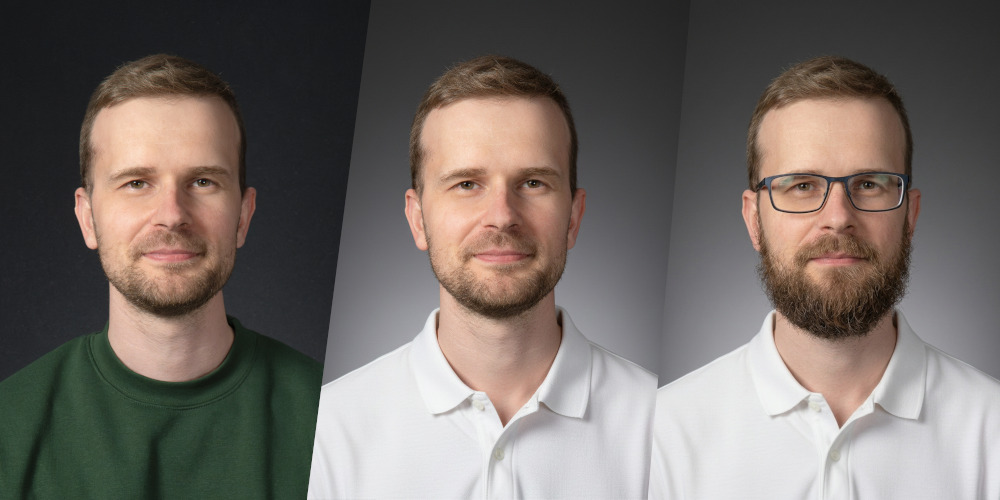
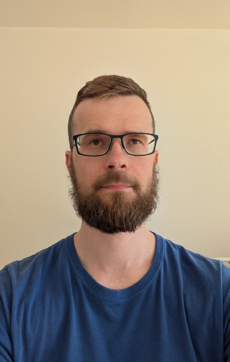
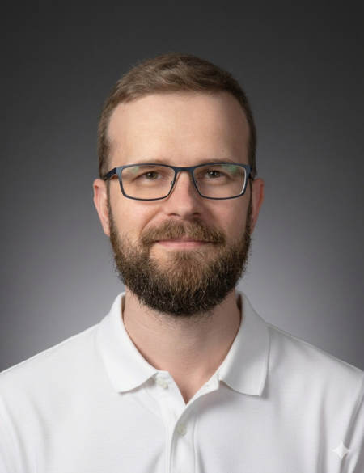
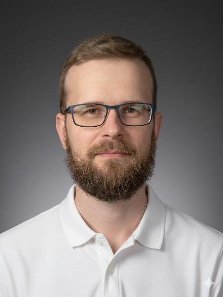

# Editace portrétu s Gemini 3 Flash Image

Poslední dobou si hraju s úpravou obrázků v různých chatbotech, a napadlo mě zkusit upravit portrétovou fotku, kterou mi dělal kolega fotograf cca před rokem a půl (viz níže portrét vlevo). Nelíbila se mi na ní zelená mikina a příliš tmavé pozadí. Pozadí by se jistě dalo vyřešit v nějakém fotoeditoru, ale mikina jen těžko.

Po diskusi s Gemini vyhrála varianta neutrálního bílého trika s límečkem a světlejšího pozadí (viz výše portrét uprostřed). Chtěl jsem mít portrét do CVčka, který by se hodil jak do korporátu, tak do startupu. S výsledkem jsem byl velmi spokojen, a po oříznutí a lehkém vyretušování [v GIMPu](https://www.gimp.org/) jsem se rovnou zbavil i vodoznaku bílé hvězdy, který Gemini generuje v pravém dolním rohu. Skvělé, ušetřilo mi to čas a peníze za novou fotku.

Postupem času jsem ale docela výrazně změnil "image" (přibyly brýle a plnovous) a dokonce se mi stalo, že mě lidé podle fotky nepoznali. Pokusy s prompty typu "Přidej brýle a plnovous" dopadly bídně - a navzdory různému ladění se mi nepodařilo dosáhnout uspokojivé shody. Nastal tedy čas na pokus s jednoduchou selfie a přenesením vzhledu. Následující fotku jsem použil jako referenci pro podobu brýlí a vousů:

<!-- more -->

První verze nebyly nic moc - zejména v chatbotu Grok, který zatvrzele vytvářel viditelně odlišné brýle a vousy (mám trochu podezření, že je to záměr, aby nešlo snadno provést face swap). Navíc, lidská tvář má spoustu drobných detailů a i pár malých odchylek způsobí, že si člověk není moc podobný.

Výsledky Gemini (konkrétně modelu _Nano Banana 2_ - oficiálně _Gemini 3 Flash Image_) už byly slibné, ale stále to nebylo ono. Např. verze níže má příliš velké oči a o trochu širší hlavu:

Po troše ladění jsem nakonec vytvořil prompt, který dodal solidní podobu. Jak je vidět níže, bylo potřeba přesně identifikovat problém a modelu říct, co má udělat (předcházela mu delší konverzace včetně vložené referenční fotky):

> Cool. Recently, I got glasses and beard. Can you add them to the photo? Keep the face proportions - especially eyes (there is the interesting effect that the glasses optically make my eyes a bit smaller) and the beard length.

Po stránce angličtiny není ten prompt žádný zázrak, ale výsledný obrázek mi tak trochu vyrazil dech:

Není dokonalý, ale je až děsivě dobrý. Na jednu stranu je fajn, že nemusím k fotografovi, na druhou stranu je vidět, jak potenciálně snadné (a stále jednodušší) je vytvářet vysoce přesvědčivé digitální napodobeniny.
