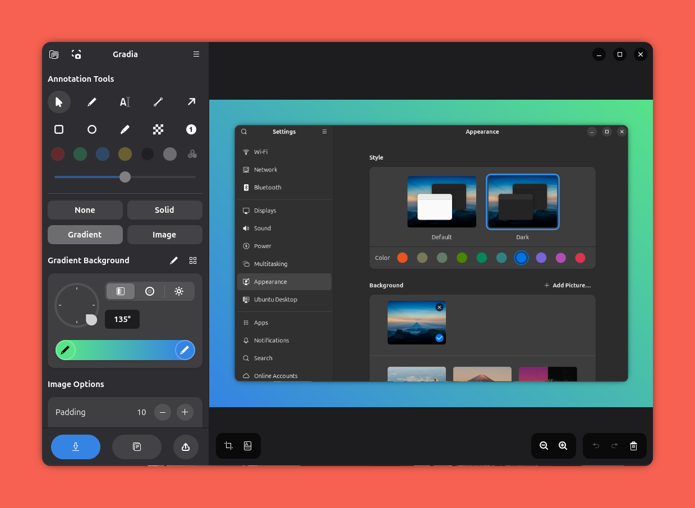
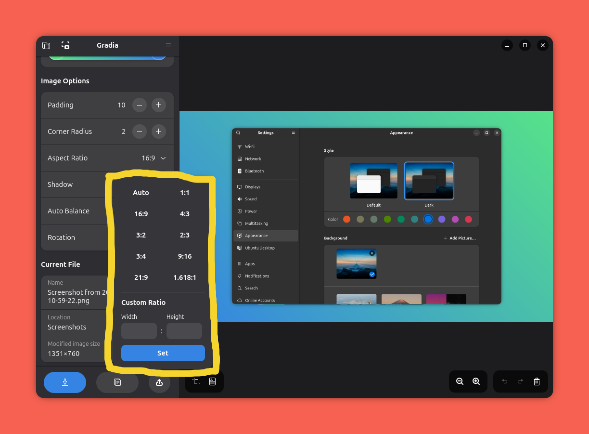

# Gradia: aplikace pro úpravu screenshotů

[Release Notes ke Gnome 50](https://release.gnome.org//50/) zmiňují řadu užitečných aplikací, mimo jiné [Gradia](https://flathub.org/en/apps/be.alexandervanhee.gradia). Aplikace slouží k úpravě a anotaci screenshotů, což občas potřebuji. Doteď jsem používal [GIMP](https://www.gimp.org/), příp. [screely.com](https://screely.com/) (služba, zdá se, není dostupná), přičemž úpravy nebyly zrovna pohodlné. Oproti této kombinaci je Gradia velmi jednoduchá a praktická.

Níže přikládám screenshoty, vytvořené - jak jinak - pomocí Gradia:



K dispozici je řada funkcí: např. výběr barvy a stylu pozadí, zvýrazňování, nebo vkládání šipek a popisků. Zajímavou vlastností je možnost upravit poměr stran výsledného obrázku:



Aplikace je oficiálně distribuovaná prostřednictvím Flatpaku:

```sh
flatpak install flathub be.alexandervanhee.gradia
```
