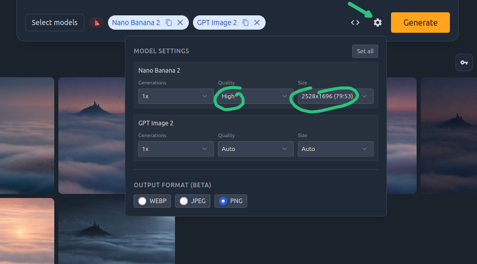

# Generování obrázků s ImageRouter

Od té doby, co s modely chatuji přes [Open WebUI](https://docs.openwebui.com/) (cloudové modely volám přes [OpenRouter](https://openrouter.ai/)), prakticky nepotřebuji používat chatboty jako ChatGPT, Gemini nebo Grok. Jediným zbývajícím důvodem pro mě zůstávalo generování obrázků. V rámci bezplatných účtů ale člověk brzy narazí na limity. A platit si několik různých předplatných jen kvůli pár obrázkům měsíčně mi přijde trochu zbytečné.

OpenRouter sice podporuje i [Image Generation API](https://openrouter.ai/docs/guides/features/server-tools/image-generation), ale nenašel jsem snadný způsob, jako ho napojit na Open WebUI. Zajímavou alternativu nabízí služba [ImageRouter](https://imagerouter.io/). Stačí si nabít kredit a začít generovat. (Nabití kreditu se v mém případě zadrhlo na straně ImageRouteru, ale napsal jsem jim zprávu a během pár hodin vše vyřešili.) Služba sice nabízí i "free" modely, ale 3 obrázky denně jsou dost málo. Vedle obrázků by mělo jít generovat i video (což jsem zatím nezkoušel).

Co se týče __ceny__, záleží na konkrétním modelu. Například model OpenAI GPT Image 2, který v době psaní článku patří mezi nejlépe hodnocené text-to-image modely ([podle Artificial Analysis](https://artificialanalysis.ai/image/leaderboard/text-to-image)), při ceně 0.04 USD za obrázek umožní za 5 USD vygenerovat obrázků 125. To je pro moje potřeby naprosto dostačující, a navíc za zlomek ceny jednoho měsíčního předplatného. Ceny jsou vidět [v přehledu modelů](https://imagerouter.io/models).

Výhodou je, že vedle volání přes API jde použít _i grafické rozhraní v prohlížeči_, takže není třeba nic napojovat a člověk se může rovnou pustit do práce, viz níže.

/// caption
Grafické uživatelské rozhraní ImageRouter.
///

Jak je vidět v horní části screenshotu výše, stejný prompt (včetně příloh) jde poslat více modelům najednou.

<!-- more -->

Užitečnou vlastností je i možnost vybrat kvalitu a rozlišení. To chatboti jako ChatGPT zpravidla neumožňují. Viz níže:

/// caption
Nastavení generování, včetně kvality a rozlišení výstupu.
///

Nedávno jsem narazil na portfolio fotografa Martina Raka na [Behance](https://www.behance.net/martinrak). Vedle toho [má i web](https://www.martinrak.cz/galerie/), kde jdou fotky snadno stáhnout.

Hodně se mi zalíbil [Hazmburk ve vlnách - České středohoří](https://www.martinrak.cz/galerie/ceska-krajina/#hazmburk-ve-vlnach-245) a chtěl jsem ho použít jako pozadí plochy. Fotka je ale dost světlá a v noci by z ní bolely oči. Zkusil jsem tedy pomocí ImageRouteru vygenerovat různé varianty, které by více ladily s tmavým režimem mého Ubuntu desktopu. Viz níže (v levém horním rohu je originál):

Nejlepší výsledek nakonec vytvořil model Nano Banana 2 (vpravo dole). GPT Image 2 sice vytvořil zajímavější barevnou kompozici (vlevo dole), ale v obrázku byly zřetelné "fleky" i při maximální kvalitě.

Nové pozadí vypadá hezky, nerušivě a jsem s ním spokojen.
