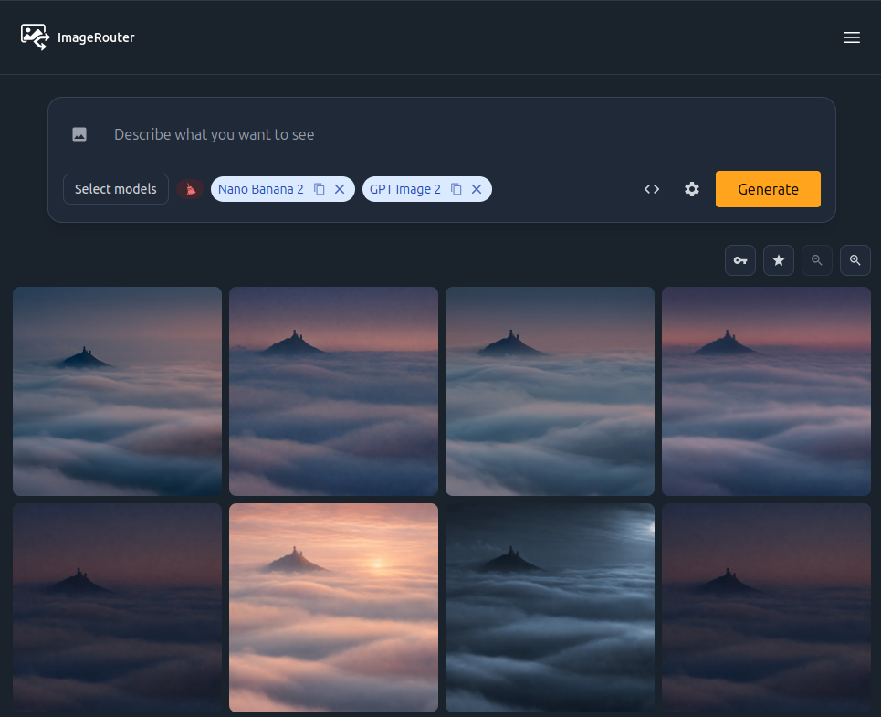
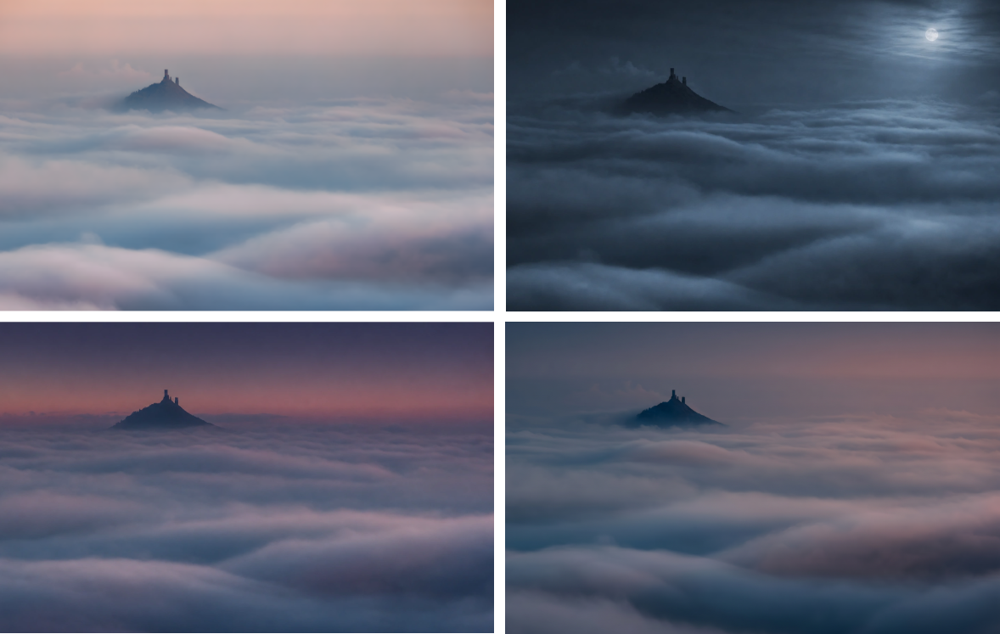

# Generování obrázků s ImageRouter

Od té doby, co s modely chatuji přes [Open WebUI](https://docs.openwebui.com/) (cloudové modely volám přes [OpenRouter](https://openrouter.ai/)) nemám prakticky potřebu využívat chatboty jako ChatGPT, Gemini nebo Grok. Jediný důvod, proč jejich rozhraní příležitostně spustím je generování obrázků. V rámci bezplatných účtů ale člověk brzy narazí na limity (např. 3 obrázky v ChatGPT denně). A platit si x různých předplatných kvůli pár obrázkům měsíčně mi přijde trochu zbytečné.

OpenRouter sice podporuje i [Image Generation API](https://openrouter.ai/docs/guides/features/server-tools/image-generation), ale nenašel jsem snadný způsob, jako ho napojit na Open WebUI. Zajímavou a principiálně obdobnou variantu nabízí služba [ImageRouter](https://imagerouter.io/). Stačí si nabít pár dolarů kreditu a začít generovat. (Služba sice nabízí i "free" modely, ale 3 obrázky denně jsou dost málo. Nabití kreditu se v mém případě zadrhlo na straně ImageRouteru, ale napsal jsem jim zprávu a během pár hodin vše vyřešili.)

Výhodou je, že vedle volání přes API je k dispozici _i grafické rozhraní v prohlížeči_, takže není třeba nic napojovat a rovnou se jde pustit do práce - viz níže.

<!-- more -->

---

