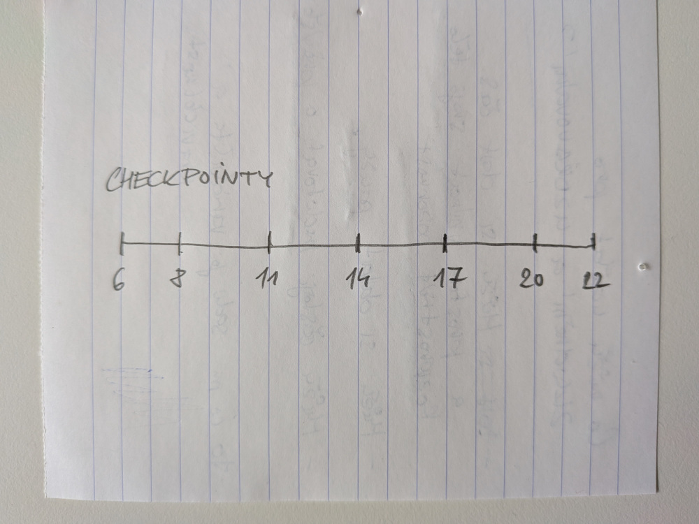

# Vibe coding Kruhu pravidelnosti

[Stop Making TUIs](https://sockpuppet.org/blog/2026/08/20/stop-making-tuis/) ([via](https://simonwillison.net/2026/Aug/21/stop-making-tuis/)): Thomas Ptacek mě inspiroval zkusit si vibe coding nějakého grafického uživatelského rozhraní. Výsledkem je jednoduchá aplikace níže. Nazývám jí _Kruh pravidelnosti_ (anglicky to byl trochu oříšek, nakonec jsem zvolil název _The Guiding Circle_).

<iframe
  src="/assets/guiding-circle.html"
  title="The Guiding Cirle"
  width="100%"
  style="display: block; height: auto; aspect-ratio: 1; border: 0"
  loading="lazy"
></iframe>

## Motivace

Už delší dobu se snažím ve svém životě posílit klidnou pravidelnost. Zpravidelnit spánkový režim, jídlo a pohybové aktivity. Nutriční specialistka mi doporučila jíst 5x denně v pravidelných intervalech. Když jsem si to rozpočítal, tak to vychází na 1 jídlo každé 3 hodiny. Zároveň najíst se hned ráno po probuzení mi nevyhovuje, a poslední jídlo před ulehnutím by mělo být optimálně 2 hodiny předem. Spolu se vstáváním (v 6) a ulehnutím (ve 22) z toho vzešlo 7 časových bodů, _checkpointů_:

<!-- more -->

/// caption
První verze ala papír a tužka
///

To je samozřejmě ideální scénář, _šablonu_. Zároveň musím říct, že pravidelné časy na jídlo se mi dost osvědčily. Odpadlo zbytečné rozhodování a po relativně krátké době si tělo začalo samo říkat: "Hele, už je 11, už je čas se najíst".

Navíc je mezi checkpointy dost času na práci, další aktivity nebo pauzy. Záměrně nikde nepíšu, zda se jedná o snídani, oběd, svačinu, večeři apod. Šablona je tak mnohem flexibilnější. Někdy prostě vstanu později a celé se to o 1 jídlo posune. No stress. Důležité je, že ostatní checkpointy zůstávají.

Nedávno jsem si říkal, že by se hodilo vidět, kde se právě v rámci dne nacházím. Tak jsem agentovi (OpenCode + GPT-5.6 Luna) stručně popsal, co potřebuju a nechal si vytvořit digitální verzi. Agent měl dobrý dotaz, jak reprezentovat čas mezi 22. a 6. ráno, tedy prostor pro spánek. To mě před tím nenapadlo a přirozeně z toho vyšel kruh.

Zkusil jsem barevně odlišit různé fáze dne a vystoupily díky tomu věci, které jsem před tím neviděl: polovina dne (od 20 do 8) je čas na psychické uvolnění, odpočinek a spánek, druhá polovina (od 8 do 20) na aktivity. Třebaže se jedná o velmi jednoduchou aplikaci, často mi během dne pomůže se zastavit a v klidu si naplánovat, co dál. Zbytečně se nepřetěžovat.

## Poznámky

Přiznám se, že se jedná o první program, který jsem vytvořil, resp. si nechal vygenerovat, a vůbec netuším, jak funguje. Ověření funkčnosti je ale celkem případě přímočaré, takže jsem s tím v míru. V JavaScriptu prakticky neprogramuji. Vytvoření něčeho podobného by mi zabralo dost času a úsilí, s agentem to ale bych hotové za chvíli a ještě mi pomohl koncept lépe promyslet a vylepšit.

Zdrojový kód je k dispozici na GitHubu.
