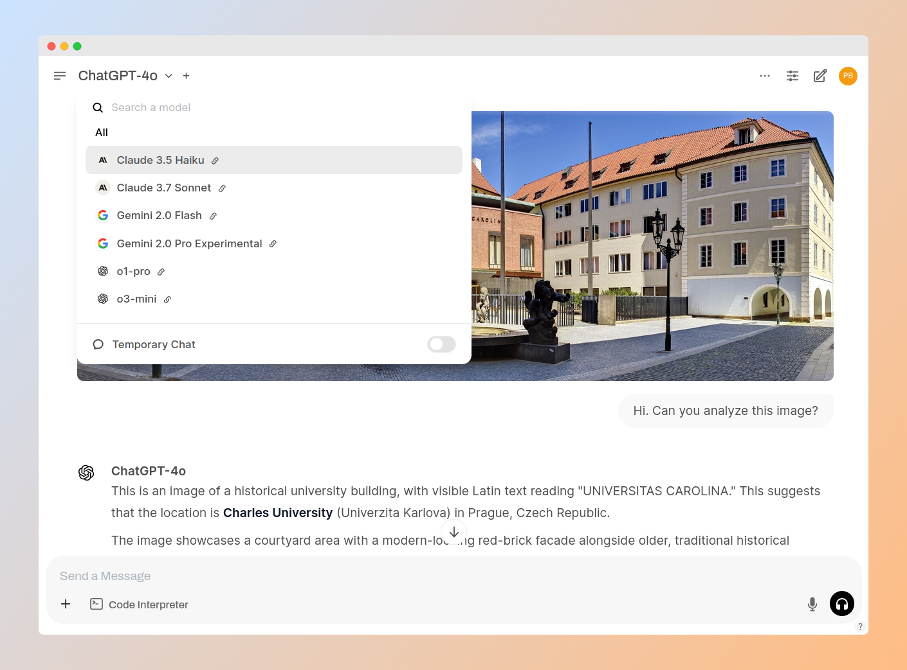

# Open-source AI Sandbox


/// caption
Screenshot aplikace Open WebUI. Vytvořeno pomocí [Screely](https://screely.com/) a [GIMP](https://www.gimp.org/).
///

## Motivace

V roli metodika AI na Univerzitě Karlově mě překvapilo, jak obtížné je i pro takto velkou instituci získat přístup k enterprise verzi chatbotů jako ChatGPT. (Naši uživatelé sice mají k dispozici Microsoft Copilot for Education. Ten je ale v řadě případů nedostačující.) Generativní AI je nová technologie jejíž přínosy (i rizika) teprve objevujeme, takže vidina finančně nákladné investice s nejistým výsledkem není moc lákavá. Zároveň si firmy kladou vysoké požadavky na minimální počet licencí a cenu.

S tím souvisí i riziko neefektivního využívání, jak se přesvědčili např. na Univerzitě Palackého v Olomouci. Pořídili překladač DeepL Pro Advanced for Teams za ~12500 EUR/rok (52 licencí), aby nakonec zjistili, že to byla slepá ulička:

> \- Licencí bylo málo, každý chtěl licenci jen pro sebe  
> \- Mnozí z těch, kdo chtěli licenci, si ji nakonec neaktivovali, zůstali viset v systému  
> \- Ti, kteří licenci dostali, ji pořádně nevyužívají, cca 50 přeložených dokumentů měsíčně  
> \- Ti, kteří ji chtějí využívat intenzivně, jsou omezeni 20 soubory měsíčně  
-- [Nasazení překladače DeepL na UP (příspěvek na konferenci EUNIS-CZ 2024)](https://euniscz.sharepoint.com/:p:/r/sites/vykonny-vybor/Sdilene%20dokumenty/Konference/Hlavn%C3%AD%20konference%20%C5%A0pindler%C5%AFv%20Ml%C3%BDn/2024%20-%2027-29_5/soubory%20na%20web/27.%205.%20pond%C4%9Bl%C3%AD/UPOL%20EUNIS%202024%20DeepL.pptx)

<!-- more -->

Komplikované bylo i zařídit přihlašování pomocí univerzitního SSO. Vydali se proto cestou vývoje vlastní aplikace využívající DeepL API. Díky tomu mají ke službě přístup všichni zaměstnanci. V rámci finančního modelu pay-as-you-go se (vyjma několika pevných poplatků) platí za počet přeložených znaků. Za uživatele, co aplikaci nevyužívají, se neplatí nic. Uživatelé mají zároveň virtuální peněženku s kreditním limitem, který je motivuje k šetrnému využívání.

S podobným nápadem, ale ve formě _chatbota_, přišli na americkém Harvardu. Na konci roku 2023 řešili situaci, kdy jim firmy jako OpenAI nebyly schopné nebo ochotné nabídnout akceptovatelné smluvní podmínky. Vytvořili si proto vlastní aplikaci s názvem Harvard AI Sandbox (více viz [video prezentace](https://www.youtube.com/watch?v=61zn8Q6lK08)):

> The AI Sandbox provides a secure environment in which to explore Generative AI, mitigating many security and privacy risks and ensuring the data entered will not be used to train any vendor large language models (LLMs). It offers a single interface that enables access to the latest LLMs from OpenAI, Anthropic, Google, and Meta.  
-- [Harvard AI Sandbox](https://www.huit.harvard.edu/ai-sandbox)

Výhodou API bývá i závazek firem, že nebudou využívat vložená data k dalšímu trénování modelů (je třeba vždy ověřit v obchodních podmínkách).

Nutno podotknout, že _výsledný chatbot není náhradou jedna ku jedné za ChatGPT, Claude nebo Gemini_. Tyto produkty budou nejspíš vždy o krok napřed. Na druhou stranu ale _stačí, aby byl dostatečně dobrý pro praktické využití_. AI Sandbox tak může pokrýt základní poptávku nebo sloužit při výuce, a drahé produkty pořídit těm, kdo je skutečně využijí.

## Implementace

Nevím o tom, že by Harvard zveřejnil zdrojový kód své aplikace. Zároveň mám dlouhodobě dobré zkušenosti s open-source softwarem. Nabízí se tak otázka, zda už náhodou neexistuje dostatečně dobrá alternativa, použitelná přinejmenším jako proof of concept.

Hlavní kritéria výběru:

1. Jedná se o populární projekt s aktivním vývojem. Kód je plně auditovatelný. Ideálně nabízí i enterprise support.
1. Přes API lze využívat pokročilé modely od OpenAI, Anthropic a Google (případně i další).
1. Aplikace je víceuživatelská, s jednoduchou administrací a s rozdělením uživatelů podle rolí a skupin. Ideálně s přihlašováním pomocí SSO.
1. Lze sledovat využívání modelů, a u placených omezit útratu. Ideálně formou již zmíněné peněženky.
1. Lze vkládat soubory (text, obrázky, tabulky).

Doplňková kritéria:

1. Lze využívat lokálně běžící open-source modely.
1. Snadná rozšířitelnost o další funkcionalitu. Ideálně pomocí Pythonu.
1. Podpora různých modalit, nejen text, ale i generování obrázků, hlasového vstupu s výstupu.
1. Možnost nasazení na serveru i na desktopu (pro maximální soukromí).
1. Uživatelské rozhraní je i v češtině.

Postupně jsem prošel a vyzkoušel řadu aplikací (mimo jiné [LibreChat](https://github.com/danny-avila/LibreChat), [AnythingLLM](https://github.com/Mintplex-Labs/anything-llm), [Jan](https://github.com/janhq/jan), [GPT4All](https://github.com/nomic-ai/gpt4all), [Text generation web UI](https://github.com/oobabooga/text-generation-webui)) a výše uvedená kritéria (s výjimkou peněženky) nyní nejlépe splňuje [Open WebUI](https://github.com/open-webui/open-webui). Běh open-source modelů zajišťuje [Ollama](https://github.com/ollama/ollama) (z důvodu jednoduchosti; od kolegy jsem však slyšel, že plánují přejít na [vLLM](https://github.com/vllm-project/vllm)).

Open WebUI podporuje defaultně jen připojení na OpenAI a s ní kompatibilní API. Pro připojení k Anthropic a Google je potřeba využít dodatečné funkce, ať už vlastní, nebo [vytvořené komunitou](https://openwebui.com/functions). Nevýhodou je, že je to kód navíc, který je potřeba zkontrolovat a udržovat. Na druhou stranu to vypadá, že možnosti rozšířitelnosti pomocí [Tools, Functions & Pipelines](https://docs.openwebui.com/features/plugin/) jsou [zajímavé](https://www.reddit.com/r/LocalLLaMA/comments/1h4mq5f/supercharged_openwebui_my_magical_toolkit_for/).

Zkušenosti s nasazením a pilotním provozem plánuji nasdílet v některém z budoucích příspěvků.

## Jak si AI Sandbox vyzkoušet?

* Open WebUI [lze nainstalovat na vlastním počítači různými způsoby](https://docs.openwebui.com/getting-started/quick-start/). Např. pomocí [uv](https://docs.astral.sh/uv/):
  ```
  uvx --python 3.11 open-webui@latest serve
  ```
* Projekt [E-infra](https://www.e-infra.cz/) hostuje [instanci Open WebUI](https://docs.cerit.io/en/docs/web-apps/chat-ai) s několika open-source modely. Pro přístup je potřeba být mít účet v rámci [MetaCentrum VO](https://www.metacentrum.cz/cs/VO/)

Další detaily lze nalézt na [GitHubu](https://github.com/peberanek/ai-sandbox).
