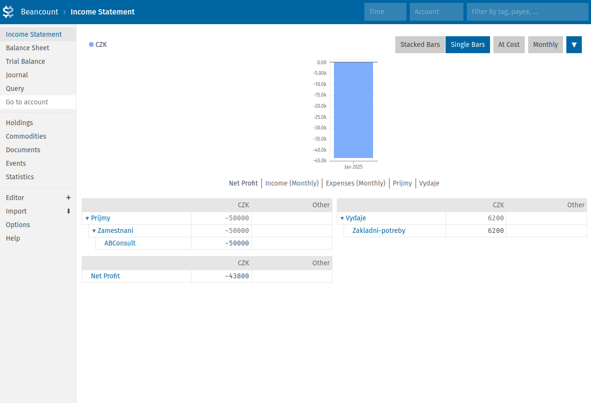
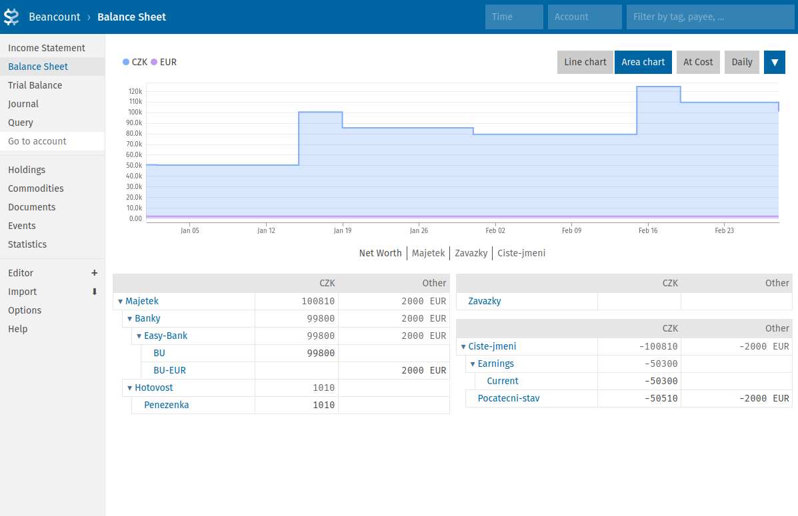
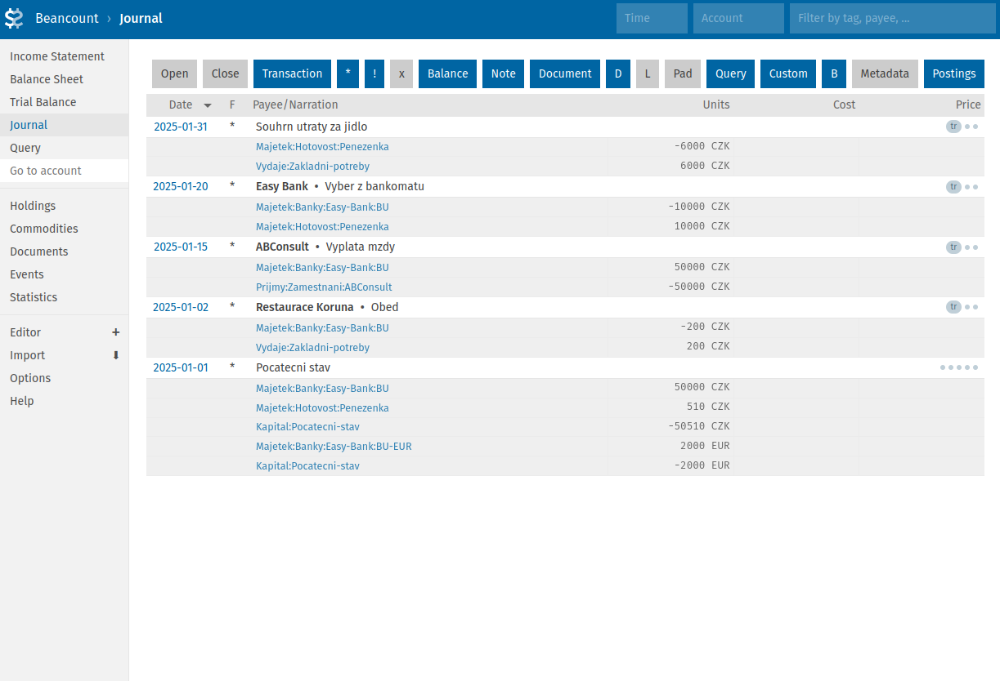
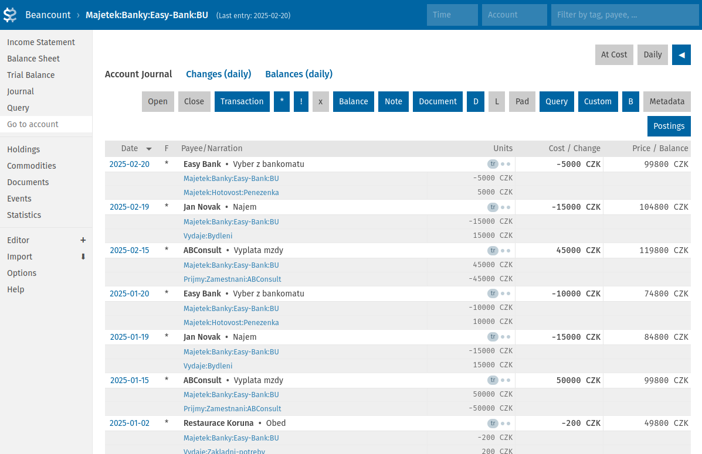
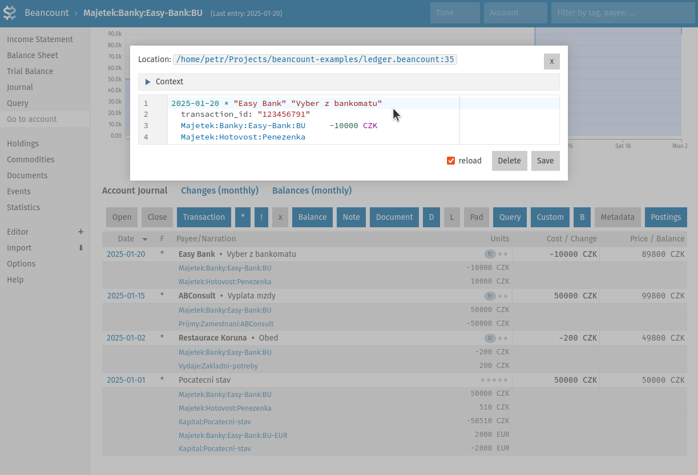

# Osobní účetnictví: Má to smysl?

Následující text je zamyšlením nad posledními 10 lety, kdy si vedu osobní účetnictví, tj. kompletní přehled majetku a závazků, příjmů a výdajů. Od úplných začátků s tužkou a papírem až po automatizované zpracování pomocí open-source aplikací. V článku uvádím důvody, které mě k tomu vedly a sdílím své zkušenosti.

## Proč jsem s osobním účetnictvím začal

V roce 2015 jsem padnul na finanční dno a k tomu skončil na dva měsíce v nemocnici. Celkem drsná životní lekce. Na druhou stranu, na chvíli jsem nemusel řešit účtenky, penále, a především nesplnitelné požadavky lidí v mém okolí, a to mi dalo příležitost se vzpamatovat a zvednout. Shodou okolností se mi v té době dostala do ruky kniha _Bohatý táta, chudý táta_ od Roberta Kiyosakiho a Sharon Lechter. Třebaže je Kiyosaki poněkud kontroverzní autor (což jsem zjistil až později), jeho historka o bohatém tátovi mě motivovala si udělat v penězích pořádek.

<!-- more -->

Jednou z oblastí, kterou Kiyosaki uvádí jako klíčovou pro budování bohatství, je znalost účetnictví. Nemá tím na mysli stát se účetním, ale porozumět principům a umět je využít ve svůj prospěch. Základy účetnictví jsem měl na střední škole (jeden z těch předmětů, co si říkáte, že nikdy nevyužijete), a tak mě napadlo vytvořit si funkční model rozvahy, výsledovky a jednotlivých účtů, vše zjednodušené pro osobní potřebu.

Kdo někdy finančně zápasil, asi mi dá za pravdu, že přemýšlet a mluvit v tom stavu o penězích je bolest. Velká bolest. A taky strach, možná i pocit selhání. Člověk by nejraději dělal, že jeho finanční problémy neexistují, vytěsnil je, zapomněl. A tím se vše ještě zhorší. Ono to na první pohled vypadá logicky: protože máme finanční problémy, nechceme o nich mluvit. Já si ale dovolím tvrdit, že je tomu naopak: _protože jsme naučení o naší finanční realitě nemluvit, tabuizovat ji, nepřemýšlet nad ní, tak právě proto máme menší či větší finanční problémy_. A osobní účetnictví se mi osvědčilo jako nástroj, jak si toto přemýšlení ulehčit a dát mu systém a řád.

Zajímavé je, že jakmile jsem začal sepisovat svůj majetek, začaly se objevovat další a další zapomenuté peníze. A dluhy, poctivě vyčíslené, přestaly vypadat tak strašidelně. Dodnes vnímám jako velkou výhodu to, že už nemusím vše držet v hlavě. Možnost mít čísla a data vizualizovaná před sebou mi dává větší klid a mentální kapacitu pro hledání nových řešení. Ať už se jednalo o strategii placení dluhů, osekávání zbytečných výdajů nebo dnes třeba o investice. (Mimochodem, čím dál více začínám souhlasit s názorem, že investice s největší návratností jsou do ty vzdělání.)

## Od tužky a papíru k automatizaci

### Excel/Calc

Na střední jsme účtovali ručně, takže jsem přirozeně začal s tužkou, papírem a opakováním _Učebnice účetnictví_ z roku 2006. Počítat vše manuálně nebo s kalkulačkou se však omrzí dost rychle, takže dalším logickým krokem byl Excel, resp. LibreOffice Calc (v principu je to totéž). Calc je fajn v tom, že dává značnou flexibilitu ve výpočtech a vizualizacích, aniž by musel člověk programovat. Dodnes ho využívám na některé přehledy. S množstvím dat ale začala narůstat i komplexita a s ní nároky na údržbu a detekci chyb, takže jsem se po nějaké době vydal hledat robustnější řešení.

### Pokus o vlastní databázi

S úsměvem nyní vzpomínám na epizodku, kdy jsem v rámci kurzu Úvodu do databází dostal nápad, že bych přece mohl udělat PostgreSQL databázi s nějakým jednoduchým front-endem. Jako studijní projekt to bylo fajn, ale člověk nakonec zjistí, že než vlastní vývoj je zpravidla efektivnější použít něco už hotového a prověřeného.

### Komerční aplikace

Jednou z možností bylo jít cestou služeb jako [YNAB (You Need a Budget)](https://www.ynab.com/) nebo [Mint](https://mint.intuit.com/). Nicméně kombinace předplatného a nutnosti někomu svěřovat své kompletní finanční informace mě nelákala. Zároveň může být později složité data získat zpět nebo převést jinam. Např. výše zmíněný Mint byl v roce 2023 ukončen, resp. začleněn pod [Credit Karma](https://en.wikipedia.org/wiki/Credit_Karma). Mimochodem, věděli jste, že existovala aplikace [Microsoft Money](https://en.wikipedia.org/wiki/Microsoft_Money)? Její podpora byla ukončena v roce 2011, prý pro nedostatečnou poptávku.

### Open-source a GnuCash

Ve vodách open-source jsem narazil na [HomeBank](https://www.gethomebank.org/), [ledger](https://ledger-cli.org/) a [GnuCash](https://gnucash.org/), přičemž nejvíc mě tehdy oslovila poslední z nich, a to kombinací podvojného účetnictví a "klikacího" rozhraní (které ledger, tuším, tehdy neměl). Na specifika rozhraní jsem si zvyknul, a na nějakou dobu mi nevadilo ani manuální zadávání. GnuCash sice umí importovat data ze souboru, ale z důvodu osobní pohodlnosti jsem tuto funkci zatvrzele ignoroval. Například kvůli chybějícím ID transakcí, což by v praxi znamenalo vždy vše překontrolovat a opravovat případné duplicity.

Postupem času i GnuCash začalo ukazovat své limity. Základní automatizace pomocí Pythonu se nakonec dala zvládnout (motivovalo mě zjištění, že [Fio banka API](https://www.fio.cz/bankovni-sluzby/api-bankovnictvi) uvádí ID transakcí i aktuální zůstatek). Vedle oficiálních [Python bindings](https://wiki.gnucash.org/wiki/Python_Bindings) existuje i slušně zdokumentovaný balíček [piecash](https://github.com/sdementen/piecash) (kredit autorovi), se kterým šla řada věcí udělat. Při hrátkách s kryptoměnami jsem ale narazil. GnuCash podporuje maximálně 6 desetinných míst a např. Bitcoin potřebuje 8 (jiné kryptoměny i více). Hackování tedy bylo dost a nastal čas hledat něco flexibilnějšího.

!!! Poznámka

    Pro detailně rozepsané výhody a nevýhody některých aplikací doporučuji [tento přehled](https://beancount.github.io/docs/command_line_accounting_in_context.html#why-not-just-use-a-spreadsheet).

## Beancount aneb Plain Text Accounting v praxi

> I believe that the method of double-entry counting should be taught to everyone at the high school level everywhere as it is a tremendously useful organizational skill, and I hope that this text can help spread its knowledge beyond professional circles.  
-- [Martin Blais (z dokumentace k aplikaci Beancount)](https://beancount.github.io/docs/the_double_entry_counting_method.html#introduction)

V rámci průzkumu jsem objevil [Plain Text Accounting (PTA)](https://plaintextaccounting.org/), což znamená ukládání a zpracování účetních záznamů v textových souborech. Vedle již zmíněné aplikace _ledger_ (nebo [hledger](https://hledger.org/)) tento přístup implementuje i [Beancount](https://github.com/beancount/beancount/), který je napsaný v Pythonu (a částečně v C). Holt k některým věcem jsem potřeboval dospět, resp. být komfortní s prací v textovém editoru a v příkazové řádce.

Není mojí ambicí v tomto článku poskytnout detailní úvod do Beancountu (viz [dokumentace](https://beancount.github.io/docs/index.html)) ani do podvojného účetnictví (viz např. [tento detailní průvodce](https://beancount.github.io/docs/command_line_accounting_in_context.html)). Třeba někdy v budoucnu. Níže uvedu alespoň pár příkladů jako malou ochutnávku.

V případě zájmu je možné najít všechny příklady v následujícím repozitáři:

``` sh
git clone https://github.com/peberanek/beancount-examples.git
```

Pro instalaci balíčků je použit moderní rychlý správce závislostí [uv](https://docs.astral.sh/uv/getting-started/installation/):

``` sh
cd beancount-examples
uv sync
```

### Ukázková účetní kniha

Níže následuje komentovaný příklad velmi jednoduché účetní knihy (anglicky _ledger_):

<div class="annotate" markdown>

``` beancount title="ledger.beancount"
; Options (1)
option "name_assets" "Majetek" (12)
option "name_liabilities" "Zavazky" (13)
option "name_equity" "Ciste-jmeni" (14)
option "name_income" "Prijmy"
option "name_expenses" "Vydaje"
option "operating_currency" "CZK" (11)

; Ucty (2)
2025-01-01 open Majetek:Banky:Easy-Bank:BU     CZK (3)
2025-01-01 open Majetek:Banky:Easy-Bank:BU-EUR EUR (4)
2025-01-01 open Majetek:Hotovost:Penezenka     CZK
2025-01-01 open Ciste-jmeni:Pocatecni-stav     CZK, EUR (5)
2025-01-01 open Prijmy:Zamestnani:ABConsult    CZK
2025-01-01 open Vydaje:Bydleni                 CZK
2025-01-01 open Vydaje:Zakladni-potreby        CZK
  note: "jidlo, zakladni spotrebni zbozi a sluzby" (6)

; Transakce (7)
2025-01-01 * "Pocatecni stav"
  Majetek:Banky:Easy-Bank:BU      50000 CZK
  Majetek:Banky:Easy-Bank:BU-EUR   2000 EUR
  Majetek:Hotovost:Penezenka        510 CZK
  Ciste-jmeni:Pocatecni-stav (8)

2025-01-02 * "Restaurace Koruna" "Obed" (9)
  transaction_id: "123456789" (10)
  Majetek:Banky:Easy-Bank:BU       -200 CZK
  Vydaje:Zakladni-potreby

2025-01-15 * "ABConsult" "Vyplata mzdy"
  transaction_id: "123456790"
  Majetek:Banky:Easy-Bank:BU      50000 CZK
  Prijmy:Zamestnani:ABConsult

2025-01-19 * "Jan Novak" "Najem"
  transaction_id: "123456791"
  Majetek:Banky:Easy-Bank:BU     -15000 CZK
  Vydaje:Bydleni

2025-01-20 * "Easy Bank" "Vyber z bankomatu"
  transaction_id: "123456792"
  Majetek:Banky:Easy-Bank:BU     -10000 CZK
  Majetek:Hotovost:Penezenka

2025-01-31 * "Souhrn utraty za jidlo"
  Majetek:Hotovost:Penezenka      -6000 CZK
  Vydaje:Zakladni-potreby

2025-02-15 * "ABConsult" "Vyplata mzdy"
  transaction_id: "123456793"
  Majetek:Banky:Easy-Bank:BU      45000 CZK
  Prijmy:Zamestnani:ABConsult

2025-02-19 * "Jan Novak" "Najem"
  transaction_id: "123456794"
  Majetek:Banky:Easy-Bank:BU     -15000 CZK
  Vydaje:Bydleni

2025-02-20 * "Easy Bank" "Vyber z bankomatu"
  transaction_id: "123456795"
  Majetek:Banky:Easy-Bank:BU      -5000 CZK
  Majetek:Hotovost:Penezenka

2025-02-28 * "Souhrn utraty za jidlo"
  Majetek:Hotovost:Penezenka      -8500 CZK
  Vydaje:Zakladni-potreby
```

</div>

1.  `;` uvozuje komentáře. Nastavení níže umožňují používat vlastní názvy kategorií účtů místo anglických Assets, Liabilities atd. Více viz [Options](https://beancount.github.io/docs/beancount_language_syntax.html#options) a [Beancount Options Reference](https://beancount.github.io/docs/beancount_options_reference.html).
2.  Více viz [Accounts](https://beancount.github.io/docs/beancount_language_syntax.html#accounts)
3.  BU je zkratka pro "běžný účet"
4.  BU v Eurech. Koncovka `-EUR` je jen moje konvence pro vytváření unikátních názvů účtů.
5.  Je možné mít více měn na jednom účtu. V praxi to ale nedoporučuji (až na výjimky, jako je tato), protože při větším množství transakcí se ztrácí přehlednost.
6.  Volitelná metadata. Každá direktiva (řádek začínající datumem) může mít neomezené množství metadat. Více viz [Metadata](https://beancount.github.io/docs/beancount_language_syntax.html#metadata_1).
7.  Transakce je nejčastější direktivou, nicméně existují i další typy direktiv. Více viz [Directives](https://beancount.github.io/docs/beancount_design_doc.html#directives)
8.  Částka se dopočítá se automaticky, pokud to kontext dovoluje. Více viz [Elision of Amounts](https://beancount.github.io/docs/beancount_design_doc.html#elision-of-amounts)
9.  Transakce má nejen popis `"Obed"`, ale i protistranu (_Payee_) `"Restaurace Koruna"`. `*` je příznak (_Flag_) a znamená, že transakce je v pořádku. Pomocí příznaku `!` lze označit transakce, co potřebují další kontrolu. Technicky existují i další příznaky, viz [Flags](https://github.com/beancount/beancount/blob/master/beancount/core/flags.py).
10. Možnost přidávat volitelná metadata, v tomto případě ID transakce, je velmi praktická. Např. pro automatickou kontrolu při importu, zda už daná transakce v knize a na daném účtu existuje. Podobná metadata bývají dostupná při volání přes bankovní nebo burzovní API.
11. Měna preferovaná pro reporty. Vyžadováno nástrojem Fava. Viz další kapitola.
12. Majetek, tedy to co vlastním.
13. Závazky, tedy to co dlužím.
14. Čisté jmění. Počítá se automaticky jako rozdíl mezi majetkem a závazky.

!!! Poznámka

    Třebaže Beancount plně podporuje diakritiku, v praxi se mi osvědčilo ji nepoužívat. Píšu bez ní rychleji. Samozřejmě záleži na vkusu, resp. rozložení klávesnice.

Kontrolu syntaxe a dodržení základních účetních pravidel provedeme pomocí příkazu `bean-check` (neměl by vypsat žádnou chybu):

``` sh
uv run bean-check ledger.beancount
```

Dalším užitečným příkazem je `bean-query`, který slouží k [dotazování pomocí jazyka podobnému SQL](https://beancount.github.io/docs/beancount_query_language.html):

``` sh
uv run bean-query ledger.beancount 'SELECT date, payee, narration, account, position WHERE account ~ "Majetek" AND date = 2025-01-02;'
```

```
   date           payee        narr           account            position
----------  -----------------  ----  --------------------------  --------
2025-01-02  Restaurace Koruna  Obed  Majetek:Banky:Easy-Bank:BU  -200 CZK
```

``` sh
uv run bean-query ledger.beancount 'balances'
```

```
           account                 SUM((position))   
------------------------------  ---------------------
Majetek:Banky:Easy-Bank:BU       99800 CZK           
Majetek:Banky:Easy-Bank:BU-EUR               2000 EUR
Majetek:Hotovost:Penezenka        1010 CZK           
Ciste-jmeni:Pocatecni-stav      -50510 CZK  -2000 EUR
Prijmy:Zamestnani:ABConsult     -95000 CZK           
Vydaje:Bydleni                   30000 CZK           
Vydaje:Zakladni-potreby          14700 CZK
```

K běžnému prohlížení účetní knihy je ale zpravidla jednodužší použít GUI, viz následující kapitola.

### Grafické uživatelské rozhraní Fava

Výše uvedenou knihu lze prohlížet a editovat pomocí grafického uživatelského rozhraní [Fava](https://beancount.github.io/fava/).

``` sh
uv run fava ledger.beancount
```

Aplikace běží jako lokální server dostupný na adrese `http://127.0.0.1:5000` (adresa serveru by se měla objevit ve výstupu příkazu).

Níže přidávám několik komentovaných screenshotů:


/// caption
Přehled příjmů a výdajů
///

Obrázek výše: Kvůli zachování účetních principů vychází kladné příjmy a čistý zisk (Net Profit) jako záporné číslo, což může být ze začátku matoucí. Jako pomůcka může sloužit představa, že to jsou peníze, které někomu jinému ubyly.


/// caption
Rozvaha
///

Obrázek výše: Namísto anglických označení Assets, Liabilities a Equity používám raději Majetek, Závazky a Čisté jmění (automaticky vypočtený rozdíl mezi majetkem a závazky; princip záporného znaménka je stejný jako v případě příjmů - viz výše).


/// caption
Transakční žurnál
///

Obrázek výše: Všechny transakce (a další direktivy) jsou přehledně uvedeny v žurnálu. V žurnálu se dá filtrovat, ať už se jedná o typ direktivy, časové období, účet, tag nebo třeba protistranu (Payee).


/// caption
Přehled transakcí na běžném účtu
///

Obrázek výše: Po klikutí na název účtu se zobrazí transakce spojené s daným účtem. (Vizualizace přírůstku a úbytku prostředků na účtu je na tomto screenshotu pro přehlednost skrytá.)


/// caption
Vestavěný editor transakcí
///

Obrázek výše: Po kliknutí na datum transakce je možné transakci editovat přímo ve webovém rozhraní.

!!! Poznámka

    Pro zájemce vytvořili správci aplikace Fava [interaktivní demo](https://fava.pythonanywhere.com) s komplexní účetní knihou.

### Volání z Pythonu

Jedním z benefitů Beancountu je, že ho jde volat i jako knihovnu. Např. takto:

``` py title="read_transaction.py"
"""Read first transaction in `ledger.beancount` and print it as a Python object."""

from beancount.core.data import filter_txns
from beancount.loader import load_file
from rich import print as rprint

entries, errors, options_map = load_file("ledger.beancount")
transaction = next(filter_txns(entries))

rprint(transaction)
```

Provést instrukce v souboru výše jde např. takto:

``` sh
uv run python3 read_transaction.py
```

Výstup je následující:

``` py
Transaction(
    meta={
        'filename': '/home/petr/tmp/beancount-examples/ledger.beancount',
        'lineno': 19,
        '__tolerances__': {}
    },
    date=datetime.date(2025, 1, 1),
    flag='*',
    payee=None,
    narration='Pocatecni stav',
    tags=frozenset(),
    links=frozenset(),
    postings=[
        Posting(
            account='Majetek:Banky:Easy-Bank:BU',
            units=50000 CZK,
            cost=None,
            price=None,
            flag=None,
            meta={'filename': '/home/petr/tmp/beancount-examples/ledger.beancount', 'lineno': 20}
        ),
        Posting(
            account='Majetek:Hotovost:Penezenka',
            units=510 CZK,
            cost=None,
            price=None,
            flag=None,
            meta={'filename': '/home/petr/tmp/beancount-examples/ledger.beancount', 'lineno': 22}
        ),
        Posting(
            account='Ciste-jmeni:Pocatecni-stav',
            units=-50510 CZK,
            cost=None,
            price=None,
            flag=None,
            meta={
                'filename': '/home/petr/tmp/beancount-examples/ledger.beancount',
                'lineno': 23,
                '__automatic__': True
            }
        ),
        Posting(
            account='Majetek:Banky:Easy-Bank:BU-EUR',
            units=2000 EUR,
            cost=None,
            price=None,
            flag=None,
            meta={'filename': '/home/petr/tmp/beancount-examples/ledger.beancount', 'lineno': 21}
        ),
        Posting(
            account='Ciste-jmeni:Pocatecni-stav',
            units=-2000 EUR,
            cost=None,
            price=None,
            flag=None,
            meta={
                'filename': '/home/petr/tmp/beancount-examples/ledger.beancount',
                'lineno': 23,
                '__automatic__': True
            }
        )
    ]
)
```

Transakce jde i zapisovat:

``` py title="write_transaction.py"
"""Write a Beancount Transaction to stdout."""

from beancount.core.data import Transaction, Posting, EMPTY_SET, Amount
from beancount.core.flags import FLAG_OKAY
from beancount.parser.printer import print_entry
import datetime
from decimal import Decimal

transaction = Transaction(
    meta={"transaction_id": "123456789"},
    date=datetime.date(2025, 1, 1),
    flag=FLAG_OKAY,
    payee="Easy Bank",
    narration="Vyber hotovosti",
    tags=EMPTY_SET,
    links=EMPTY_SET,
    postings=[
        Posting(
            account="Majetek:Banky:Easy-Bank:BU",
            units=Amount(Decimal(-1000), "CZK"),
            cost=None,
            price=None,
            flag=None,
            meta={},
        ),
        Posting(
            account="Majetek:Hotovost:Penezenka",
            units=Amount(Decimal(1000), "CZK"),
            cost=None,
            price=None,
            flag=None,
            meta={},
        ),
    ],
)

print_entry(transaction)

```

Po provedení instrukcí v souboru získáme výstup ve formě transakce ve formátu Beancount.

``` sh
uv run python3 write_transaction.py
```

``` beancount
2025-01-01 * "Easy Bank" "Vyber hotovosti"
  transaction_id: "123456789"
  Majetek:Banky:Easy-Bank:BU  -1000 CZK
  Majetek:Hotovost:Penezenka   1000 CZK
```

Není nutné, aby transakce byla validní. To je výhoda v případě, že potřebuji vytvořit transakci, pro kterou nemám kompletní informace a budu ji manuálně doplňovat. Případně lze transakci označit pomocí `FLAG_WARNING` namísto `FLAG_OK` v případech, kdy transakce validní je, ale stejně bude potřebovat dodatečnou kontrolu.

### Výhody a nevýhody

Zásadní výhodou Beancountu je pro mě flexibilita:

* nad účetními knihami jde volat standardní unixové příkazy jako `grep` nebo `sed`, a zároveň jdou verzovat např. pomocí Gitu,
* vedle vestavěných příkazů jako `bean-check` a `bean-query` jde doinstalovat další pomocné aplikace jako již zmíněná Fava, [beangulp](https://github.com/beancount/beangulp) (framework pro importování transakcí) nebo [pricehist](https://gitlab.com/chrisberkhout/pricehist) (informace o směnných kurzech a cenách aktiv),
* díky podpoře pro prakticky jakékoliv aktivum (cizí měny, kryptoměny, akcie, nemovitosti apod.) a možnosti zaznamenávat nákupní ceny (Cost basis) jde využít při obchodování,
* funkcionalitu jde libovolně rozšiřovat pomocí [systému pluginů](https://beancount.github.io/docs/beancount_scripting_plugins.html) ([příklady](https://github.com/beancount/beancount/tree/master/beancount/plugins)) nebo voláním Beancountu jako knihovny Pythonu (viz [API reference](https://beancount.github.io/docs/api_reference/index.html)),
* už dříve jsem psal, že [soubor, resp. data jsou důležitější než aplikace](../posts/soubor-je-vic-nez-aplikace.md), a Beancount tuto filozofii naplňuje,
* vzhledem k tomu, že účetní kniha je textový dokument, nabízí se zde zpracování pomocí velkých jazykových modelů (ideálně lokálně běžících - pro větší soukromí). Jak známo, jazykové modely nebývají přesné ve výpočtech, zároveň ale dokáží volat nástroje (např. udělat dotaz pomocí [Beanquery MCP](https://github.com/vanto/beanquery-mcp)). V praxi jsem zatím neměl potřebu to využít, takže uvidíme.

Dále oceňuji praktická rozšíření pro různé textové editory (např. pro [VSCode](https://marketplace.visualstudio.com/items?itemName=Lencerf.beancount)) a komunitní podporu formou [mailing listu (Google group)](https://groups.google.com/g/beancount).

Co se týče dokumentace, ta je na jednu stranu velmi propracovaná, ale zároveň nepříliš udržovaná. Problém je v tom, že většina informací platí pro starší verzi Beancountu (v2), která má oproti nejnovější verzi (v3) několik rozdílů, což bývá pro začátečníky matoucí.

Tím se dostávám i ke dvěma hlavním nevýhodám:

* autor Beancountu - Martin Blais - nemá v posledních letech na vývoj a udržování moc času, takže opravy a nové funkce přicházejí spíše sporadicky,
* při velkém množství záznamů může být zpracování pomalé. Ve staré účetní knize jsem měl okolo 8 tisíc transakcí, řadu z nich s nákupní cenou aktiva, a výpočty trvaly i několik vteřin, což začalo zpomalovat rozšíření pro VSCode (viz výše). Před rokem a půl jsem proto založil novou účetní knihu (od 1.1.2024, k dnešnímu dni cca 1400 transakcí) a rychlost je opět velmi svižná.

## Faktory udržitelnosti

Vedení osobního účetnictví vyžaduje čas a úsilí. Navíc, naše finanční realita a některé účetní technikálie mohou být frustrující. Ze začátku jsem se na to i několikrát vykašlal, abych se ke svému "finančnímu přehledu" zase dříve či později vrátil. Protože mít přehled se mi v průběhu času vyplácí víc, než ho nemít. Níže uvádím 3 faktory, které vnímám jako zásadní pro dlouhodobou udržitelnost celé téhle aktivity.

### Jednoduchost

Začít se dá třeba jen s tužkou, papírem a otázkou "Proč mi každý měsíc zbyde tak málo a kam vlastně moje peníze tečou?" nebo "Kolik můžu dovolit investovat?". Člověk postupně začne zjišťovat nakolik byly jeho představy odchýlené od reality, kolik peněz utrácí úplně zbytečně, a přirozeně se začnou rodit nápady na optimalizaci. A na nějakou dobu nejspíš vystačí jen Excel, resp. Calc.

Aktualizace a údržba účetních knih není moc velká zábava a proto tím chci trávit co nejméně času. V praxi se mi osvědčilo účtovat jen to podstatné a neztrácet čas příliš velkými detaily. Např. výdaje za jídlo (většinou) platím v hotovosti, jednou za čas spočítám rozdíl a ten zaúčtuji. Překvapivě tak zůstane velmi málo transakcí, které je potřeba zaúčtovat manuálně, zvlášť v kombinaci s automatizovaným importem dat z banky. (Doporučení od autora Beancountu. Díky!)

Také používám jeden souhrnný účet `Výdaje:Základní-potřeby`, kam spadají jak výdaje za jídlo, tak i další spotřební zboží a služby jako drogerie, hygiena, holič apod. Typicky sem jdou větší nákupy v supermarketu, které se nevyplatí rozepisovat. Opět, co můžu (včetně služeb) platím v hotovosti a vyhnu se tak zápisu nepodstatných transakcí.

Co se naopak detailně zapisovat vyplácí, jsou nákupy dražších věcí se zárukou. Díky možnosti rychle ověřit datum nákupu jsem už několikrát věc včas reklamoval ("nenechal to být") a ušetřil tak pěkný peníz.

### Pravidelnost

Když se nám daří udržovat věci jednoduché, máme pak větší kapacitu dělat je pravidelně. Ze začátku mi hodně psychicky pomáhalo držet své peníze pod kontrolou, takže jsem si zapisoval transakce každý den ráno. Byl to takový rituál. Dnes už mi díky automatizaci stačí udělat si sezení jednou za týden. V tomhle jsem asi stále trochu extrém. Co čtu, ostatní dělají sezení zpravidla jednou za měsíc.

Pravidelnost je pro mě také zdrojem klidu. Co nesnese odklad (máloco), to vyřeším hned a zbytek můžu pustit z hlavy. Buď mě upozorní notifikace (custom skript), nebo se k tomu dostanu při příštím sezení. Oproti finančnímu stresu před pádem na dno to je velká úleva.

### Automatizace

Automatizace může být jednoduchá - pár výpočtů v Excelu, nebo sofistikovaná ve formě automatizovaného importu transací, směnných kurzů, výpočtu výnosů apod. Cokoliv Vás napadne, resp. vyplatí se svěřit stroji. Ať už kvůli rychlosti nebo redukci chyb. Nejlepší je nic netlačit na sílu a nechat věci organicky rozvíjet a růst tak, jak se vyvíjí naše potřeby a schopnosti.

Programuji v Pythonu, takže logickým vyústěním pro mě bylo začít spravovat své finance jako kód, resp. pythoní balíček včetně účetní knihy, závislostí, vlastních pluginů a skriptů, vše verzované pomocí Gitu. Tím se usnadnilo i sdílení mezi pracovní stanicí a laptopem. Stačí mi lokální gitovský repozitář na sdíleném disku, `git push`, `git pull` a hotovo.

To vše má, samozřejmě, svá specifika a pasti, a samotná automatizace by si nejspíš zasloužila vlastní článek. Uvidíme.

Jak už jsem psal výše, import ze souborů (typicky CSV) mi nevyhovuje. Preferuji API, kvůli rychlosti, stabilitě, ID transakcí a aktuálním zůstatkům. Né každá instituce API poskytuje, nicméně některé ano (v českém prostředí vím o výše zmíněné Fio bance a [Bance CREDITAS](https://www.creditas.cz/creditas-api)). Svého času jsem se proto rozhodl napsat [Beanclerk](https://github.com/peberanek/beanclerk) (framework pro import transakcí přes API) a chybějící, nebo né úplně šťastně řešené klienty ([fio-banka](https://github.com/peberanek/fio-banka), [creditas](https://github.com/peberanek/creditas)). Řadu věcí by šlo určitě udělat jednodušeji a lépe, nicméně uvedené projekty svou funkci stále spolehlivě plní, takže je uvádím jako studijní příklady.

## Shrnutí

Co jsem se naučil? Že ať chceme nebo ne, náš život v současné společnosti zásadně ovlivňují peníze, resp. naše schopnost s nimi zacházet. A tuto schopnost může významně podpořit jednoduchý systém a rutina, třeba ve formě osobního účetnictví. (Nutno podotknout, že _jednoduchý_ neznamená triviální nebo snadný.) Pravidelnost a pocit kontroly nad svými financemi mi dávají vnitřní klid. Automatizace pak šetří čas, zmenšuje prostor pro chyby a umožňuje škálovat. Namísto dojmů a emocí můžu pracovat s reálnými čísly a díky tomu dělat uváženější rozhodnutí.

Taky jsem se naučil lépe programovat v Pythonu a vydal jsem svůj první balíček na pypi.org. Bude Beancount součástí mého workflow i za dalších 10 let? Kdo ví. Jeden člověk na mailing listu [napsal](https://groups.google.com/g/beancount/c/lDwuoWUDVJ4/m/y5DI0cFoAAAJ), že si vede účetní záznamy od roku 1967. Počítače i software se od té doby hodně změnily, ale záznamy přetrvaly.

> [...] If you want to create digital artifacts that last, they must be files you can control, in formats that are easy to retrieve and read. Use tools that give you this freedom. [...] Accept that all software is ephemeral.  
-- [Steph Ango: File over app](https://stephango.com/file-over-app)

Tak jako v řadě jiných oblastní, tím nejdůležitějším ve finále budou inteligentní způsob organizace, pravidelnost a schopnost přizpůsobovat se měnícím se podmínkám.
