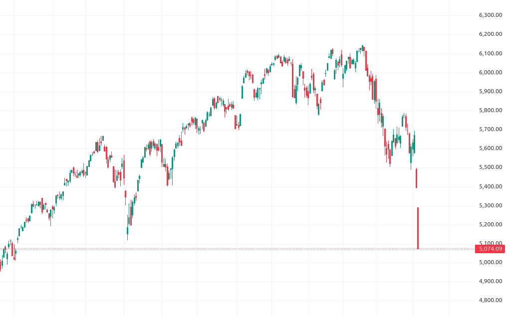

# Nové jazykové modely a panika (nejen) na trzích

## 25.3.2025

Google vydal [Gemini 2.5 Pro Experimental](https://blog.google/technology/google-deepmind/gemini-model-thinking-updates-march-2025/). Nyní #1 na [LM Arena Leaderboard](https://lmarena.ai/?leaderboard).

## 31.3.2025

> TL;DR: we are excited to release a powerful new open-weight language model with reasoning in the coming months, and we want to talk to devs about how to make it maximally useful: https://openai.com/open-model-feedback/
>
> we are excited to make this a very, very good model!  
-- [Sam Altman](https://x.com/sama/status/1906793591944646898) ([via](https://simonwillison.net/2025/Apr/1/brad-lightcap/))

## 4.4.2025

/// caption
Screenshot z aplikace TradingView zachycují propad indexu S&P 500 (denní graf za poslední rok; propad za poslední 2 dny o -10,5%).
///

## 5.4.2025

Dnes (v sobotu!) vydala Meta dvojici open-weight modelů [Llama 4](https://ai.meta.com/blog/llama-4-multimodal-intelligence/). Nyní #2 na LM Arena Leaderboard.

OpenAI:

> change of plans: we are going to release o3 and o4-mini after all, probably in a couple of weeks, and then do GPT-5 in a few months.  
-- [Sam Altman](https://x.com/sama/status/1908167621624856998) ([via](https://simonwillison.net/2025/Apr/4/sam-altman/))
