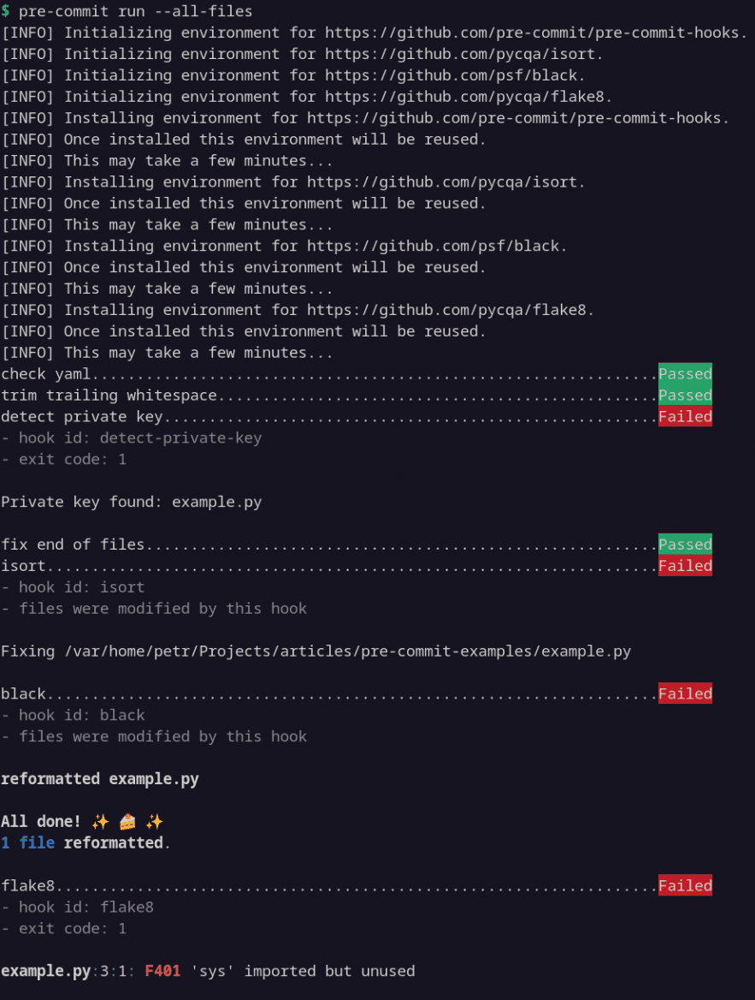
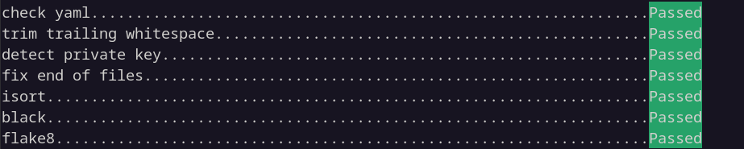

---
date:
  created: 2023-05-31
  updated: 2025-07-05
---

# Pohodlná správa zásuvných modulů v Gitu

Nástroj pre-commit je správce zásuvných modulů verzovacího systému Git. V tomto článku si ukážeme základní možnosti jeho použití, konkrétně si vyzkoušíme nastavení stejnojmenného modulu pre-commit.

_Článek byl původně zveřejněn na webu [root.cz](https://www.root.cz/clanky/pohodlna-sprava-zasuvnych-modulu-v-gitu/)._

<!-- more -->

## K čemu je nástroj pre-commit dobrý

Jednou z užitečných funkcionalit Gitu jsou zásuvné moduly ([hooks](https://git-scm.com/book/en/v2/Customizing-Git-Git-Hooks)), které mohou při určitých událostech provádět námi definované akce. Například před vytvořením revize (commit) mohou automaticky spouštět nástroje pro kontrolu, opravu a formátování kódu. Je tak mnohem snazší včas odchytávat některé chyby a dodržovat konvence daného projektu, neboli – slovy [Pavla Herouta](https://www.root.cz/autori/pavel-herout/) – udržovat „štábní kulturu“. Šetříme tak čas a úsilí jak sobě tak i lidem, kteří provádějí revizi našeho kódu (code review).

Problém ale nastane ve chvíli, kdy chceme svoje zásuvné moduly sdílet mezi projekty s různou strukturou. Nebo chceme volat program vyžadující instalaci jazyka, který v našem projektu nepoužíváme. Proto vznikl nástroj [pre-commit](https://pre-commit.com/), který umožňuje spravovat [celou řadu zásuvných modulů Gitu](https://pre-commit.com/#supported-git-hooks) (tedy nejen modul `pre-commit`, třebaže se v tomto článku budeme věnovat výhradně jemu) jednoduše a nezávisle na projektu a použitém jazyce.

!!! Poznámka

    Alternativními správci jsou například [husky](https://github.com/typicode/husky), [overcommit](https://github.com/sds/overcommit) nebo [lefthook](https://github.com/evilmartians/lefthook). Nicméně ty jsem nezkoušel. Neváhejte se tedy podělit o případné zkušenosti a srovnání v komentářích.

Vezměme praktický příklad: Před vytvořením revize (commit) chceme automaticky zkontrolovat syntax, zbavit se nadbytečných bílých znaků, předejít úniku soukromých klíčů a opravit konce souborů. Náš projekt je napsaný v jazyce Python a soubory připravené k revizi chceme nejprve opravit a zformátovat pomocí nástrojů `isort` a `black`, a poté zkontrolovat pomocí `flake8`. Toto vše tedy nadefinujeme v souboru `.pre-commit-config.yaml`, nainstalujeme balíček pre-commit a (vyjma konfiguračních detailů) se už o nic dalšího zpravidla nemusíme starat.

!!! Poznámka

    Třebaže zde uvádím příklady pro Python, pre-commit podporuje celou [řadu programovacích jazyků](https://pre-commit.com/#supported-languages).

## Instalace

!!! Info

    Ve zbývající části článku předpokládám, že máme nainstalovaný Git a Python (3.8 a vyšší).

pre-commit lze nainstalovat z pypi.org:
``` sh
python3 -m pip install --user pre-commit
```

Další možnosti (zipapp, homebrew, conda) jsou popsány [v dokumentaci](https://pre-commit.com/#installation).

## Konfigurace

Pro snadné vyzkoušení si naklonujeme repozitář s demonstračními příklady:
``` sh
git clone https://github.com/peberanek/pre-commit-examples
```

Máme zde soubor `example.py` s několika vadami ve zdrojovém kódu, a soubor `.pre-commit-config.yaml`, který nám definuje akce popsané v posledním odstavci předchozí kapitoly:
``` yaml
repos:
  - repo: https://github.com/pre-commit/pre-commit-hooks
    rev: v4.4.0
    hooks:
    - id: check-yaml  # syntax check
    - id: trailing-whitespace
    - id: detect-private-key
    - id: end-of-file-fixer
  - repo: https://github.com/pycqa/isort
    rev: 5.12.0
    hooks:
    - id: isort
      args: ["--profile", "black"]
  - repo: https://github.com/psf/black
    rev: 23.3.0
    hooks:
    - id: black
  - repo: https://github.com/pycqa/flake8
    rev: 6.0.0
    hooks:
    - id: flake8
      args: ["--max-line-length", "100"]
```

První akce – neboli plugin nástroje pre-commit – začíná odkazem na repozitář (`repo`) a označením revize nebo tagu (`rev`), které chceme nainstalovat. Následuje výčet zásuvných modulů (`hooks` pro daný plugin), které chceme volat. V našem případě provádět kontrolu syntaxe souborů ve formátu YAML, zbavovat se přebytečných bílých znaků a tak dále.

!!! Poznámka

    Kompletní přehled podporovaných zásuvných modulů pro pluginy nalezneme [v dokumentaci](https://pre-commit.com/hooks.html).

Jak můžeme vidět u pluginu `isort`, použitým nástrojům můžeme předávat i argumenty (`args`) jako při volání z příkazové řádky, což se hodí kdybychom chtěli načítat nějaký externí konfigurační soubor, například:
``` yaml
  - repo: https://github.com/PyCQA/bandit
    rev: 1.7.5
    hooks:
    - id: bandit
      args: ["-c", "pyproject.toml"]
      additional_dependencies: ["bandit[toml]"]
```

!!! Poznámka

    Opět, kompletní přehled konfigurace nalezneme [v dokumentaci](https://pre-commit.com/#adding-pre-commit-plugins-to-your-project).

## Spuštění

Jakmile máme základní konfiguraci hotovou, nainstalujeme pre-commit do našeho gitovského repozitáře:
``` sh
pre-commit install
```

Nyní se nám při každém vytváření revize (`git commit`) zavolají vybrané pluginy automaticky. Pokud si chceme funkčnost ověřit bez nutnosti vytvářet novou revizi, jde to udělat následovně:
``` sh
pre-commit run --all-files
```

!!! Info
    Bez přepínače `--all-files` pracuje pre-commit pouze se soubory připravenými k revizi (stage).


/// caption
Výstup nástroje pre-commit s problémy
///

Jak můžeme vidět na obrázku, pre-commit odhalil několik problémů. `isort` a `black` automaticky opravily řazení importů a formátování. Zapomenutý soukromý klíč (který se v reálu v repozitáři vůbec nesmí objevit) a nepoužitý modul `sys` odstraníme manuálně. Jakmile jsou problémy opravené, při tvorbě další revize (`git commit -a`) již všechny kontroly projdou.


/// caption
Výstup nástroje pre-commit po nápravě
///

Jednotlivé pluginy a jejich zásuvné moduly lze volat i samostatně, například pouze `black` (voláme pomocí hodnoty klíče `id` z konfigurace výše):
``` sh
pre-commit run black
```

## Shrnutí a další odkazy

V článku jsme si ukázali jednoduché nastavení a použití správce gitovských zásuvných modulů nazvaného pre-commit. Ten nám může usnadnit automatizaci některých rutinních akcí a ve svém důsledku tak i pomoct k více konzistentnímu a kvalitnějšímu kódu.

V případě, že vás nástroj zaujal, mohl by vás zajímat [přehled použití a správa z příkazové řádky](https://pre-commit.com/#usage-in-continuous-integration), využití v rámci [Průběžné integrace](https://pre-commit.com/#usage-in-continuous-integration) (CI) nebo [tvorba vlastních zásuvných modulů pro pluginy](https://pre-commit.com/#creating-new-hooks).

_(Autorem obrázků je Petr Beránek.)_
