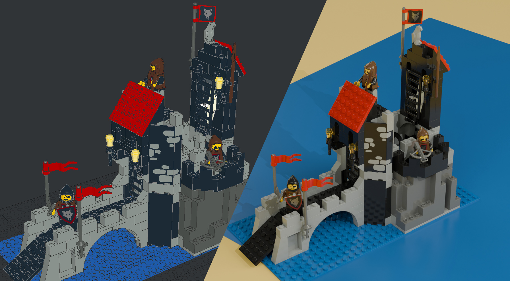

# Realistické 3D modely Lega s LeoCAD a Blender



Před pár dny jsem šel okolo obchodu s použitými dílky a stavebnicemi [Lego](https://en.wikipedia.org/wiki/Lego), a dostal velkou chuť si něco zase postavit (v dětství jsem tím strávil moře času). Bohužel, moje vlastní sbírka se v průběhu času někde ztratila a hned jít a něco si koupit se mi nechtělo. Rozhodl jsem si nejprve oživit vzpomínky pomocí open source nástroje [LeoCAD](https://www.leocad.org/), který slouží k vytváření 3D modelů z Lega.

Jako první padla volba na "Ostrovní vlčí doupě", které jsem znal jako malý jen [z katalogu](https://www.worldbricks.com/en/catalog-year/1990/catalogs-1993.raw?task=download&fid=3772) (strana 22).

<!-- more -->


/// caption
Přední strana krabice 6075 Wolfpack Tower z roku 1992 ([brickset.com](https://brickset.com/article/74078/6075-wolfpack-tower-showcasing-what-can-be-done-with-one-classic-lego-set))
///

Třebaže se stavebnice už dávno oficiálně neprodává, na internetu existuje řada webů (např. [worldbricks.com](https://www.worldbricks.com/en/lego-instructions-year/instructions-lego-1990/1992/lego-set/6075-Wolfpack-Tower.html?ic=1)) s [originálními návody](https://www.worldbricks.com/en/lego-instructions-year/instructions-lego-1990/1992.raw?task=download&fid=1988). Mimochodem, nerozbalená se dnes nabízí [za cenu okolo 24000 korun](https://www.brickeconomy.com/set/6075-1/lego-castle-wolfpack-tower).

## LeoCAD

V porovnání s nástroji jako Blender nebo Unreal Engine působí LeoCAD velmi jednoduše. V něčem je trochu neergonomický (např. pohyb kamery, manipulace s dílky a figurkami, chybějící klávesové zkratky), ale s trochou cviku a trpělivosti se to dá zvládnout. Stavět Lego fyzicky je samozřejmě jiný zážitek, ale neomezené množství dílků (včetně těch, co jsem nikdy neměl) je skvělé. Samostatnou kapitolou je hledání. Stává se, že přesně vím jaký dílek potřebuju, jen nevím, jak se jmenuje - to bývá trochu frustrující.

!!! Poznámka

    Zprovoznit LeoCAD na Ubuntu (25.10) nebylo zcela přímočaré, ale povedlo se. Problém byl ten, že při instalaci prostřednictvím balíčků `leocad` a `ldraw-parts` (knihovna dílků) aplikace padala a [snap](https://snapcraft.io/leocad) nešel nainstalovat vůbec. Zahránil mě až [flatpak](https://flathub.org/en/apps/org.leocad.LeoCAD/), který běží bez problémů a dokonce obsahuje i zmíněnou knihovnu [LDraw](https://flathub.org/en/apps/org.leocad.LeoCAD/), kterou je jinak třeba doinstalovat ručně.


/// caption
Uživatelské rozhraní LeoCAD s rozestavěným modelem
///


/// caption
Průvodce tvorbou figurky
///


/// caption
Hotový model
///

Jak je vidět z obrázků výše, LeoCAD je určený na vytvoření modelu. Vykreslit ho do fotorealistické podoby ale neumí. K tomu je potřeba použít jiný program, např. populární 3D editor [Blender](https://www.blender.org/) - viz následující kapitola.

Pro zájemce je **model k dispozici [v repozitáři na GitHubu](https://github.com/peberanek/3d-lego-models)**.

## Import a vykreslení v Blenderu

!!! Poznámka

    Ani zprovoznění Blenderu nebylo bezproblémové. V repozitáři Ubuntu je starší verze (4.0.2), což by nevadilo. Z nějakého důvodu ale nepodporuje moji GPU (Nvidia RTX 3060) a postrádá vestavěný denoiser, který výrazně urychluje vykreslování. Snap a flatpak nabízí nejnovější verzi, nicméně při pokusu otevřít položku _Edit_ > _Preferences_ aplikace v obou případech zamrzla. [Prý se jedná o bug v Gnome](https://bbs.archlinux.org/viewtopic.php?id=308598), který by měl být opravený ve verzi 49.0.2. Zatím proto spouštím aplikaci z příkazové řádky pomocí následujícího workaroundu (běh přes XWayland), a vše funguje:

    ```sh
    WAYLAND_DISPLAY="" blender
    ```

Importovat model do Blenderu jde např. pomocí pluginu [Import LDraw](https://github.com/TobyLobster/ImportLDraw). Stačilo postupovat [podle návodu](https://github.com/TobyLobster/ImportLDraw?tab=readme-ov-file#installation-and-usage), jen mě trochu zmátl popis kroků pro import modelu (kroky související s _Import 0ptions_ - viz zmíněný návod). Pointa je (1) vybrat model, který chci importovat, (2) nastavit cestu ke knihovně LDraw a pak spustit import.

Vykreslení pak může vypadat třeba takto:


/// caption
Model vykreslený do fotorealistické podoby s jednoduchým pozadím
///

Výhodou Blenderu je, že se dá vyhrát i s kulisami. Moje pokusy jsou hodně jednoduché.


/// caption
Model vykreslený s imitací modré podložky a žlutého pozadí
///


/// caption
Detail otevíratelného boku věže. Pod duchem je vidět truhla s pokladem
///
